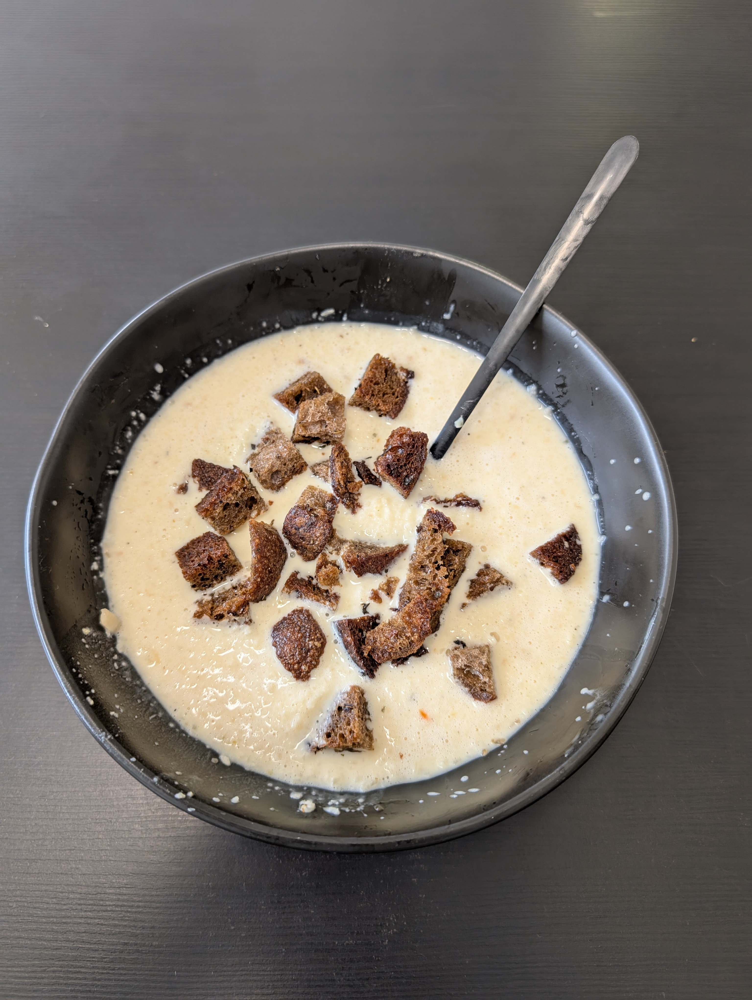

---
tags:
  - soup
aliases: 
category: 
country:
  - austria
duration_min: 
todo: false
acknowledgements: 
links:
  - https://www.gutekueche.at/apfel-kren-suppe-rezept-33071
theme: tre_light
marp: false
paginate: false
---

# Apfel-Kren-Suppe

|Ingredient|Amount (4 portions)|
| :- | :- |
|cream|300 mL|
|water|300 mL|
|apple|0.350 kg|
|horseradish|3 tbsp|
|pepper|-|
|salt|-|
|soup seasoning (vegetables)|-|

## Recipe
1. prepare [Vegetable Soup](Soup_Vegetables.md#Vegetable%20Soup)
	1. alternatively you can also use **soup-spices** and **water**
2. peel **apples**
3. cut **apples** in small cubes
4. mix **cream**, [Vegetable Soup](Soup_Vegetables.md#Vegetable%20Soup), **apple pieces**
5. let boil once
6. reduce heat and let simmer until **apples** are soft
7. add **horseradish**
8. puree with stick-blender
9. season with **salt**, **pepper** as you go

## Notes
* combines well with [BreadCroutons](BreadCroutons.md)
