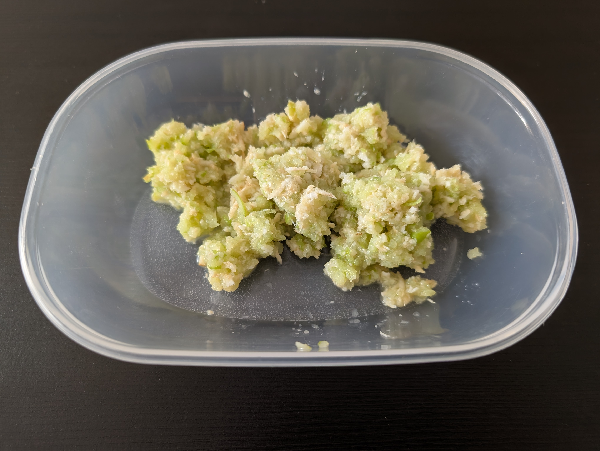

---
tags:
  - tradition
  - easter
aliases: 
category:
  - tradition
country:
  - austria
ingredients:
  - apple
  - horseradish
  - vinegar
amounts:
  - "2"
  - "0"
  - "0"
duration_min: 
todo: false
acknowledgements:
  - Daniela Steinwender
links: 
theme: tre_light
marp: false
paginate: false
---

# Apfelkren

## Recipe
1. grate **horseradish**
2. grate **apples**
3. mix
4. add a little **vinegar**

## Notes
* taste generally improves with more sweet and juicy **apples**
