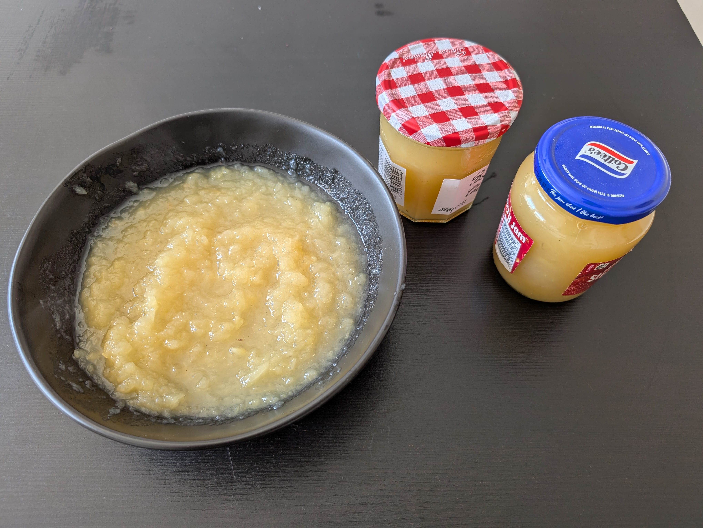

# Apfelmus

|Ingredient|Amount (4 portions)|
| :- | :- |
|water|80 ml|
|sugar|2 tbsp|
|vanilla bean|2|
|apple|1 kg|
|cinnamon stick|1|
|lemon|0.5|

## Recipe
1. rinse and peel apples
2. remove apples core
3. cut apples into small pieces
	1. add lemon juice over apples
	2. make sure all of them are covered
4. remove seeds from vanilla bean
5. boil water with vanilla (shell and seeds) and cinnamon stick
6. add apple pieces
7. let simmer for 20min on low heat
8. remove cinnamon stick and vanilla bean
9. if not very soft already, use stick blender

## Notes
