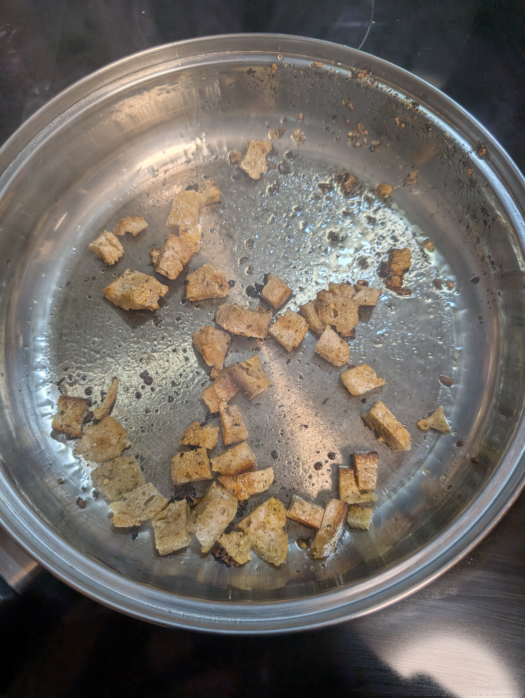

---
tags:
  - base
  - soup
category: cooking
country:
duration_min: 10
todo: false
theme: tre_light
marp: false
paginate: false
aliases:
acknowledgements:
links:
---

# Bread Croutons

|Ingredient|Amount (4 portions)|Alternative Units|
| :- | :- | :- |
|bread||
|oil (olive)||
|seasoning||

## Recipe

1. dice **OLD** **bread**
2. heat **oil** over medium heat in pan
3. add **bread**
4. add **seasoning**
5. let roast while tossing occasionally until bread becomes nice and crunchy

### What I do with old bread
* if bread becomes too dry to eat/taste good
	* dice
	* keep in ziplock bag making sure no moisture reaches the bread
	* do this whenever you have old bread
* these bread dices are an excellent base for [BreadCroutons](BreadCroutons.md) or rather turning them into [BreadCroutons](BreadCroutons.md) is an excellent way to not throw them away

## Notes
* excellent for #soup garnish