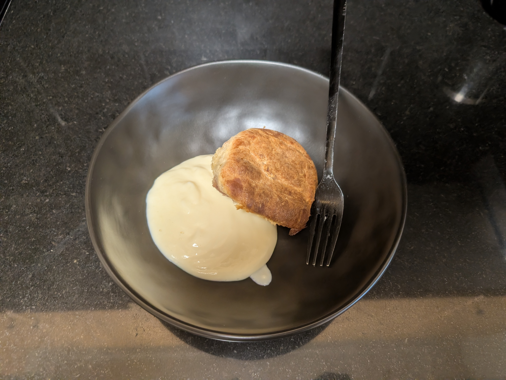
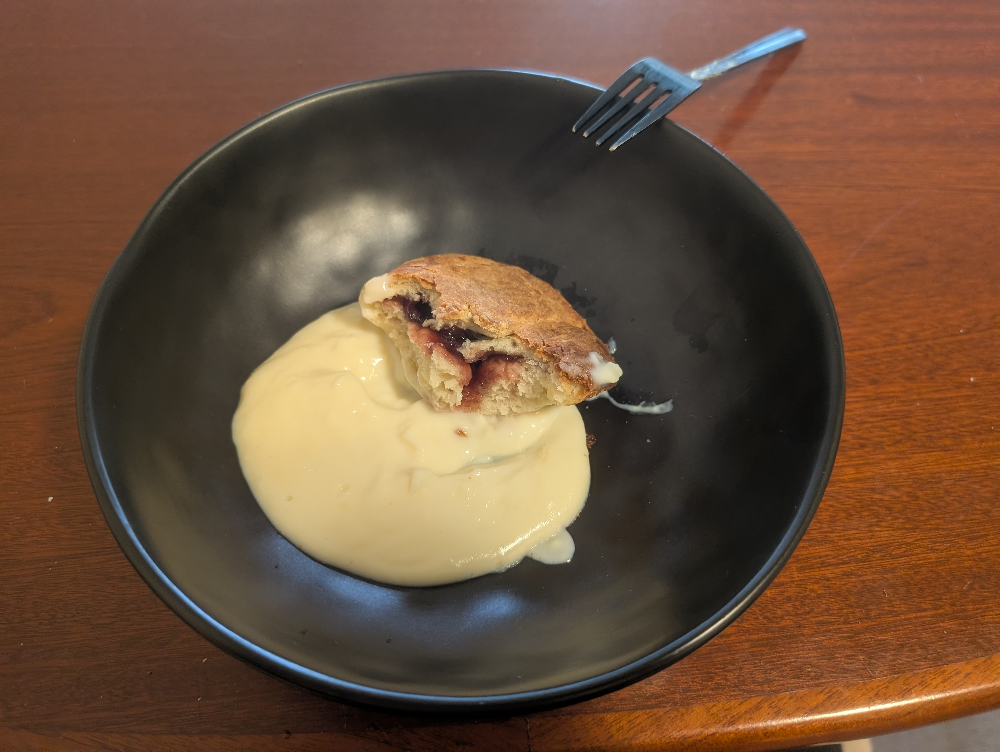

---
tags:
  - sweet
  - tradition
  - baking
category: cooking
country:
  - austria
duration_min: 140
todo: false
theme: tre_light
marp: false
paginate: false
aliases:
  - Buchtel
  - Buchteln
acknowledgements:
  - Oma Berni
links:
---

# Buchteln

|||
|:-|:-|
|||
|||

|Ingredient|Amount (10 Buchteln)|Alternative Units|
| :- | :- | :- |
|flour (wheat)|508 g|
|milk|265 mL|
|butter|100 g|
|sugar|54 g|
|egg|2|
|jam|0|
|nutella|0|
|salt|0|
|yeast (dry)|0|according to instructions|

## Recipe

### Dough
* essentially a [Germteig](Germteig.md)

1. add $\pu{500g}$ **flour** to bowl
2. create small valley in center
	1. heat **milk** until [handwarm](handwarm.md)
	2. add $\pu{15mL}$ ($5tbsp$) of the **milk**
	3. add **yeast (dry)**
	4. add $\pu{4g}$ ($1tsp$) of **sugar**
	5. mix until you get a liquid pre-dough (inside the valley)
	6. sprinkle with **flour** until surface slightly covered
3. cover with cloth and let rest for $\pu{20min}$ at warm location
	1. until visibly increased in volume and sprinkled flour shows slight cracks
	2. I often use the oven without turning it on
4. add **butter**, **eggs**, $\pu{250mL}$ **milk**, $\pu{50g}$ **sugar**, **salt**
5. mix until a smooth dough emerges
	1. ideally you use a kitchen-aid
	2. you can also do it by hand/with a fork
		1. that's what I usually do
6. shape into a rough sphere
7. cover with cloth and let rest for $\pu{20min}$ at warm location

### Preparing the baking dish
1. generously cover with **butter**
	1. it should be enough butter that each individual [Buchtel](Buchteln.md) can soak up the butter

### Filling
1. separate [Dough](#Dough) in fist-sized pieces
2. for each piece
	1. spread in a $\pu{5mm}$ disc-like shape
	2. add $\pu{1tsp}$ of the filling of your choice
		1. i.e., **jam**, **nutella**
	3. seal into a spherical shape
	4. place into prepared oven dish
3. brush with **butter** once again
4. cover with cloth
5. let [Buchteln](Buchteln.md) sit in warm location for another $\pu{20min}$

### Baking
1. preheat oven to $\pu{180^\circ C}$ for $\approx\pu{25min}$ with [Fan-Forced](OvenSettings.md#Fan-Forced)
	1. can be done while [Buchteln](Buchteln.md) are sitting for the last time
2. bake at $\pu{180^\circ C}$ for $\pu{40min}$

## Sides
* [Vanillesauce](Vanillesauce.md)

## Notes
* the traditional filling is apricot **jam**
* in case your oven dish is too small, you can stack them to a degree
	* I tested 2 layers and it worked fine

