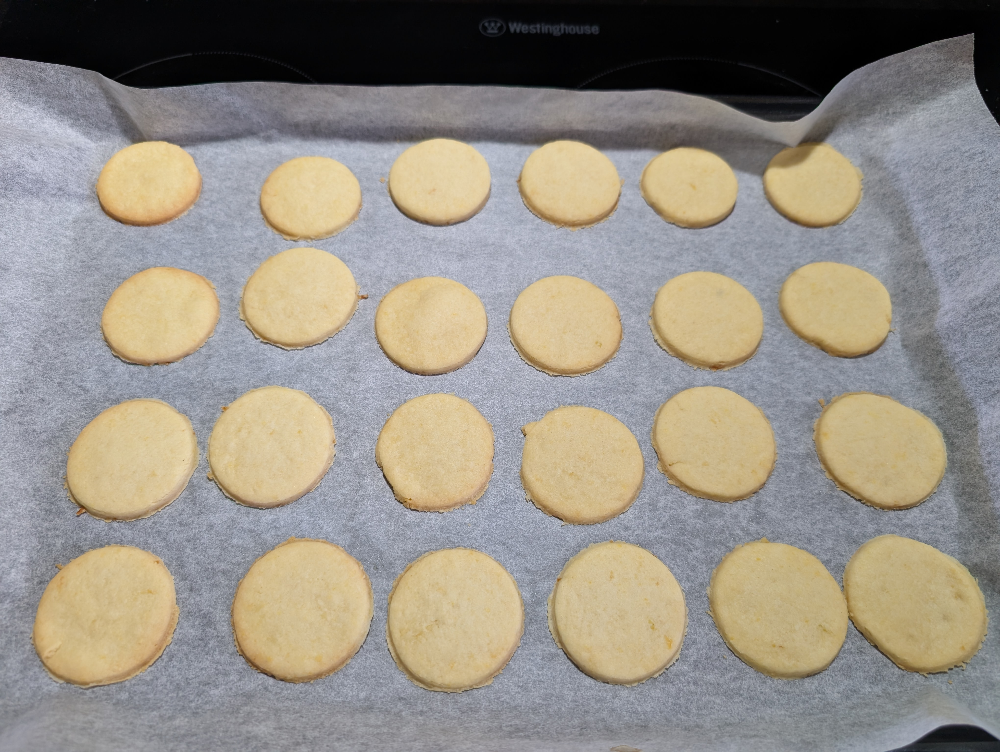

---
tags:
  - cookies
  - base
  - christmas
  - baking
aliases:
country:
duration_min: 90
todo: false
acknowledgements:
  - Daniela Steinwender
  - Oma Sylvia
links:
theme: tre_light
marp: false
paginate: false
---

# Butterkekse

|Ingredient|Amount (80 cookies)|Alternative Units|
| :- | :- | :- |
|flour|300 g|
|butter|150 g|
|sugar (icing)|100 g|
|baking powder|16 g|
|sourcream|15 g|1 tbsp|
|vanilla sugar|8 g|
|egg|1|
|lemon (bio)|1|

> even if you make more cookies than shown in the table, I recommend preparing the dough in batches corresponding to the table above.
> this ensures that you can handle the dough easily and consistently.

## Recipe

- essentially plain [Muerbteig](Muerbteig.md)

### Dough

1. grate/cut **butter**
2. grate zest of **lemon**
3. extract**egg yolk**
3. in a large bowl add **flour**, **butter**, **sugar (icing)**, **sourcream**, **vanilla sugar**, **egg yolk**, **baking powder**, **lemon zest**
4. quickly knead into dough
5. place in fridge for $\approx 1\,\mathrm{h}$
6. roll out into $\approx 2\,\mathrm{mm}$ thick dough
7. using cookie cutter
	1. cut out cookies in shapes you desire
		1. this recipe considers  circles with $4\,\mathrm{mm}$ diameter

### Baking

1. preheat oven to $170\mathrm{^\circ C}$ [Fan-Forced](OvenSettings.md#Fan-Forced)
2. bake for $10\,\mathrm{min}$
3. let cool down a little bit

## Notes
