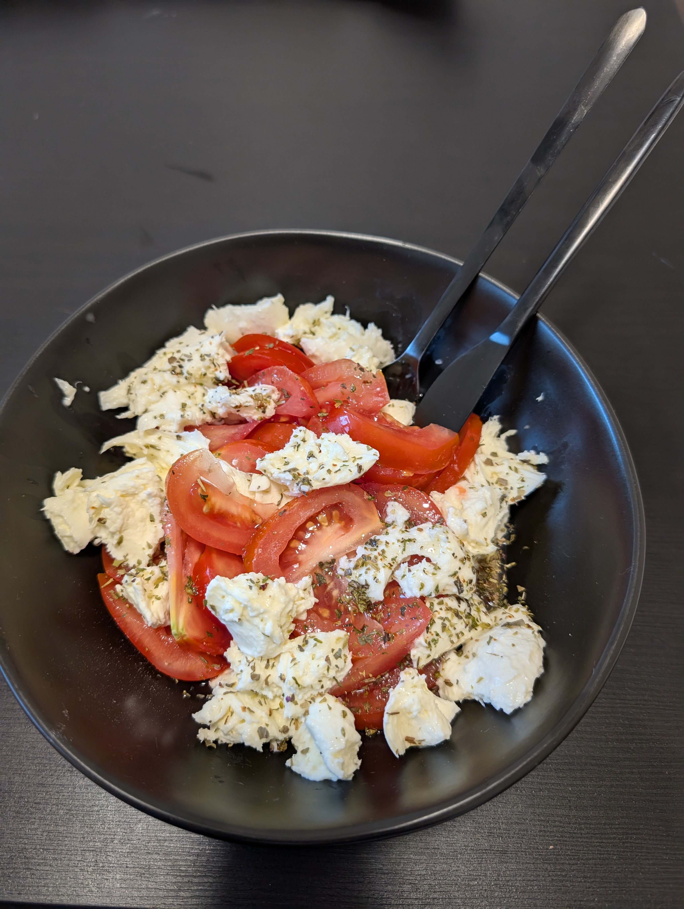

---
tags:
  - salad
category:
  - cooking
country: 
duration_min: 
todo: false
theme: tre_light
marp: false
paginate: false
aliases:
  - Tomaten Mozzarella
acknowledgements: 
links:
---

# Caprese (Tomaten Mozzarella)

|Ingredient|Amount (4 portions)|
| :- | :- |
|tomato|1000 g|
|mozzarella|250 g|
|pepper|-|
|salt|-|
|basil|-|
|bread|-|
|italian herbs seasaoning blend|-|
|oil (olive)|-|
|vinegar|-|
|lemon|-|

## Recipe
1. chop **tomatoes** into slices
1. chop **mozzarella** into slices
1. chop **basil**
1. put everything into one bowl
1. season with **(olive) oil**, **balsamico**, **salt**, **pepper**
1. serve with **bread (white)**

## Notes
