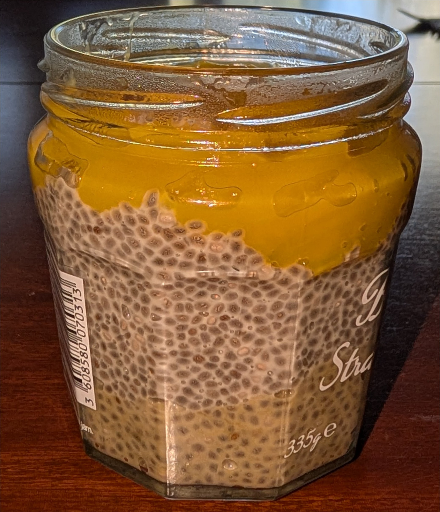

---
tags:
  - sweet
  - breakfast
aliases:
country:
duration_min: 75
todo: false
acknowledgements:
  - Keti Khutunishvili
links:
theme: tre_light
marp: false
paginate: false
---

# Chiapudding

|Ingredient|Amount (4 portions)|Alternative Units|
| :- | :- | :- |
|oat milk|400 mL|
|raspberry|200 g|
|chia seeds|90 g|
|ceral|80 g|
|honey|44 g|
|pistachio spread|38 g|

## Recipe

### Chiaseed base
1. mix **chia seeds**, **oat milk**, $\frac{2}{3}$ of **honey**
	1. make sure **honey** is liquid
	2. add honey to desired sweetness
2. let sit for $\approx 1\,\mathrm{h}$
	1. stir every now and again

### Merge
1. heat **raspberries** and $\frac{1}{3}$ of **honey**
	1. let simmer until visous
2. mix $\frac{1}{2}$ of [Chiaseed base](#Chiaseed%20base) with **pistachio spread**
	1. make sure **pistachio spread** is liquid-ish
	2. until green and creamy
3. distribute into $4$ glasses
	1. **pistachio**-[Chiaseed base](#Chiaseed%20base) mix
	2. pure [Chiaseed base](#Chiaseed%20base)
	3. **raspberry** mixture
	4. (crunchy) **cereal**

## Notes
* you can substitute **raspberries** with almost any other fruit
* you can also use frozen **raspberries**
* you can also use **maple syrup** instead of **honey**