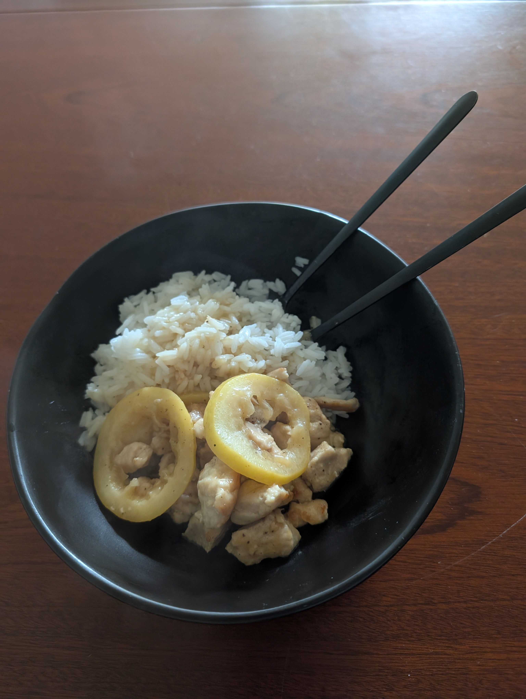

---
tags:
category:
  - cooking
country:
duration_min:
todo: false
theme: tre_light
marp: false
paginate: false
aliases:
ingredients:
amounts:
acknowledgements:
links:
---

# Chicken (Lemon Peppered)

|Ingredient|Amount (4 portions)|
| :- | :- |
|rice|800 g|
|lemon|2|
|butter|-|
|chicken breast|1.0 kg|
|honey|-|
|oil|-|
|pepper|-|
|salt|-|

## Recipe
1. slice half of the **lemons**, squeeze juice out of other half
1. sprinkle **chicken** with **salt**.
1. heat **oil** in large pan
1. add **chicken** and roast for ~4min
1. arrange lemon slices  around chicken in pan
1. (transfer to oven and bake at 200°c)
1. add lemon juice, **honey**, **butter** to pan
1. season with **salt**, **pepper**

## Side
* [rice](./Rice.md)

## Notes

* https://www.eatingwell.com/recipe/277671/baked-lemon-pepper-chicken/
