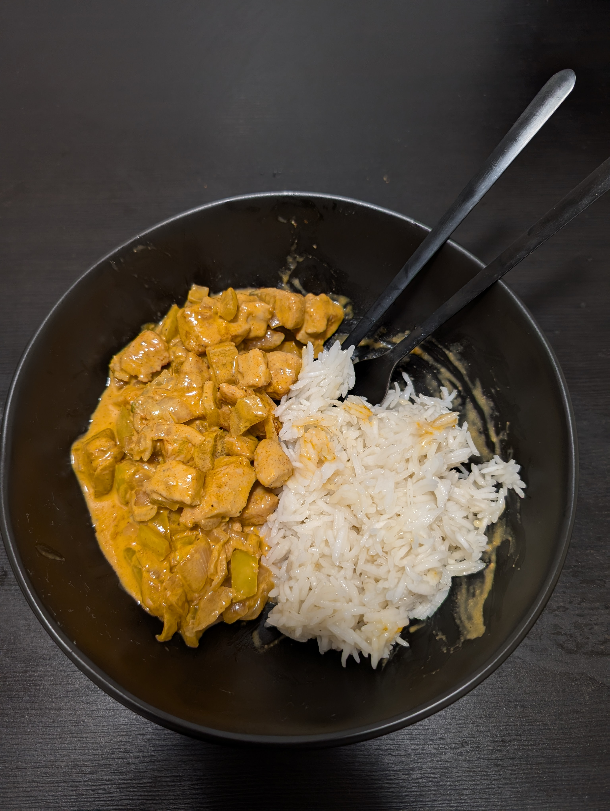

---
tags:
  - meat
category:
  - cooking
country: 
duration_min: 
todo: false
theme: tre_light
marp: false
paginate: false
aliases: 
ingredients:
  - rice
  - chicken breast
  - garlic
  - salt
  - oil
  - pepper
  - pepper spice
amounts:
  - 800g
  - 1kg
  - "0"
  - "0"
  - "0"
  - "0"
  - "0"
acknowledgements: 
links:
---

# Chicken (Paprika)

## Ingredients

## Recipe

1. preparation
    1. wash **chicken**
    2. chop **garlic** in small pieces
    3. chop **chicken** in filet-sized pieces
    4. season **chicken** with **salt**, **pepper**, **pepper powder**, (**garlic power**)
2. main
    5. heat **oil** in pan
    6. roast **garlic** in pan
    7. add **chicken** to roast alongside

## Side
* [rice](./Rice.md)

## Notes

