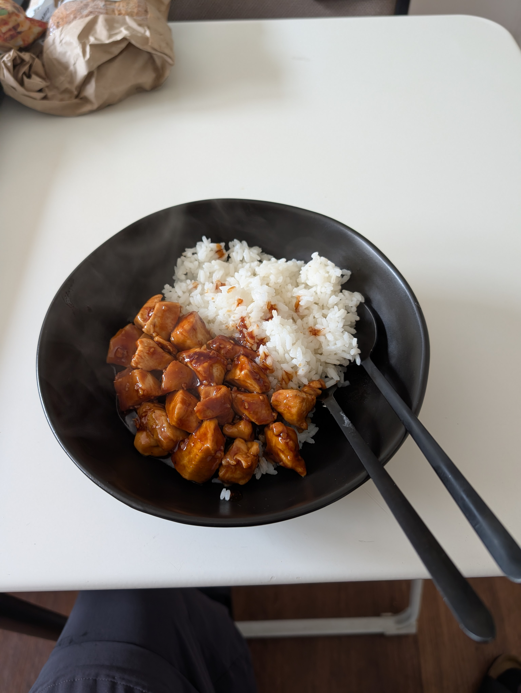

---
tags:
  - meat
category:
  - cooking
country: 
duration_min: 
todo: false
theme: tre_light
marp: false
paginate: false
acknowledgements: 
links:
  - https://www.tamingtwins.com/simple-sticky-midweek-chicken-teriyaki-recipe/
---

# Chicken (Teriyaki)

|Ingredient|Amount (4 portions)|
| :- | :- |
|rice|800 g|
|water|80 mL|
|soy sauce|20 mL|
|salt|8.5 g|
|sugar|7 g|
|honey|5 mL|
|pepper|3.5 g|
|oil (sesame)|2.5 mL|
|chicken breast|1 kg|
|garlic|-|
|ginger|-|
|starch|-|

## Ingredients

## Recipe
<!-- 1. [teriyaki-sauce](./Teriyaki_Sauce.md)
    1. mix ingredients (don’t cook yet!) -->
1. chicken
    1. heat **oil** in pan
    1. add **chicken** until cooked
        1. season with **garlic**, **ginger** as you go
    1. add [teriyaki-sauce](./Teriyaki_Sauce.md)
    1. cook until slightly thickened

## Side
* [rice](./Rice.md)

## Notes

