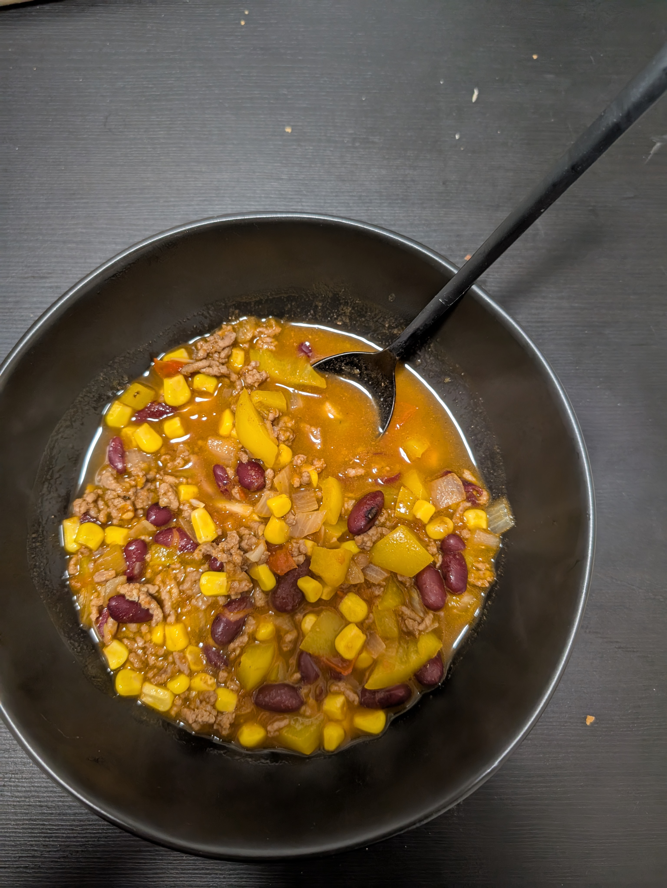

# Chilli con Carne

## Recipe

1. chop **onions**, **peppers**, **garlic**
2. heat **oil** in big pot
3. roast chopped onions
4. add **minced meat**
    1. sear in pot
5. add **tomato paste**, **tomatoes**, **water** + **soup seasoning**
    1. let simmer for $\approx20\,min$
6. season to taste with **garlic powder**, **salt**, **pepper**, **pepper powder**, **turmeric**
7. add **beans**, **corn**, **peppers**
8. add **chilli** to taste and wished spiciness
9. let brew for $\approx20\,min$ on low heat

## Side
* **bread (white)**
* **bread rolls**

## Notes

