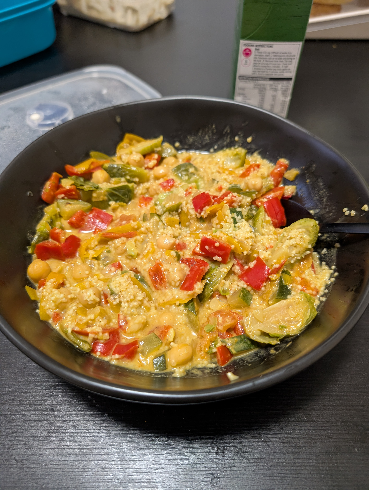

# Curry (Vegetables)

|Ingredient|Amount (4 portions)|
| :- | :- |
|rice|600 g|
|tomato|350 g|
|chickpeas|240 g|
|brussel sprouts|150 g|
|coconut milk|125 mL|
|cream|125 mL|
|carrot|3|
|garlic|2 cloves|
|onion|1|
|oil|-|
|salt|-|
|vegetable|-|
|cinnamon|-|
|curry powder|-|
|ginger|-|
|pepper|-|
|soup seasoning|-|
|water|-|

## Recipe

1. boil **water**
1. add **brussel sprouts**
    1. cook on medium heat until soft
1. heat **oil** in large pan
1. roast **onions** and **garlic**
1. add **curry powder** and **ginger**
    1. mix well
1. add **peppers**, **carrots** and other **vegetables** (i.e. zucchini)
1. add **tomatoes**
1. mix well
1. season with **salt**, **pepper**, **curry powder**
1. add **water** and **soup spice**
    1. bring to gentle simmer
1. add **chickpeas**
1. mix in some **coconut milk** or **cream**
1. season with **salt**, **pepper**, **cinamon**, **curry powder**

## Side
* [rice](./Rice.md)

## Notes
