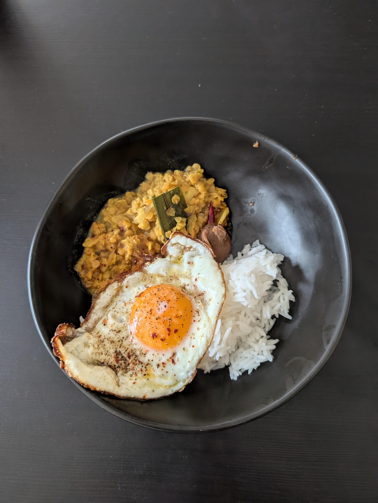

---
tags:
  - curry
aliases:
  - parippu
category:
  - cooking
country:
  - srilanka
ingredients:
  - water
  - rice
  - lentils (red)
  - coconut milk
  - curry leave
  - egg
  - garlic
  - chili (green)
  - chili (red)
  - chili flakes
  - curry powder (sri lanka)
  - cumin
  - cumin seed
  - fenugreek seed
  - mustard seed
  - pandan leave
  - turmeric
  - cinnamon stick
  - onion
  - cardamon
  - chili powder
  - oil (coconut)
  - salt
amounts:
  - 1900mL
  - 800g
  - 150g
  - 120mL
  - "15"
  - "4"
  - 3cloves
  - "2.5"
  - "2"
  - 1tsp
  - 1tsp
  - 0.5tsp
  - 0.5tsp
  - 0.5tsp
  - 0.5tsp
  - "0.5"
  - 0.5tsp
  - "0.25"
  - "0.25"
  - 1pinch
  - 1pinch
  - "0"
  - "0"
duration_min: 60
todo: true
acknowledgements:
  - Maleesha Bandara
links: 
theme: tre_light
marp: false
paginate: false
---

# Sri Lankan Dahl Curry

## Recipe

### The Curry
1. rinse **lentils (red)** 2-3 times
	1. get rid of starch
2. add a little **water** (such that the **lentils (red)** are covered) and set aside
3. chop **onion**, **garlic**, **chili (green)**, **pandan leave**
	1. just chop **garlic** do not mince!
4. in pot add **lentils (red)**, **chili (green)**
5. add $\frac{2}{3}$ of **onion**,  **garlic**, **pandan leave**, **curry leave**, **cinnamon stick**
6. add spices
	1. **salt**, **curry powder (sri lanka)**, **fenugreek seed** (ground), **turmeric**, **cumin**, **cardamon**, **chili powder**
7. add **water**, $\frac{1}{3}$ of **coconut milk**
8. let simmer until **lentils (red)** are cooked through (loose their color - turn from red/orange to yellow)
	1. stir occasionally
9. stir in remaining $\frac{2}{3}$ of **coconut milk**
10. mix well

### Tempering
1. chop **chili (red)**
	1. remove seeds to make less spicy
2. add **oil (coconut)** to pan
3. add **mustard seed**
4. once **mustard seed** pop, add remaining $\frac{1}{3}$ of
	1. **garlic**, **curry leaves**, **onion**, **chili (red)**, **pandan leave**, **chili flakes**

### Merging
1. take a little bit of [The Curry](#The%20Curry) and add it to [Tempering](#Tempering)
2. mix well
3. add the combined mixture back to the rest of [The Curry](#The%20Curry)
4. mix well

## Side
* traditionally served with
	* [Rice](Rice.md)
	* $\text{\textcolor{red}{TODO: How was the other traditional thing called?}}$

## Notes
* alternatively you can add a [Egg_Fried](Egg_Fried.md)
* [The Curry](#The%20Curry) is traditionally cooked in a clay-pot
* the traditional way of eating the curry is with ones hands
	* take a little bit of rice
	* take a little bit of [The Curry](#The%20Curry)
	* with the fingertips of your dominant hand mix both together by squeezing
	* use the fingertips to eat as well
* typically one would use
	* skim **coconut milk** for the initial cooking of the **lentils (red)**
	* thick **coconut milk** for the final stirring into [The Curry](#The%20Curry)
