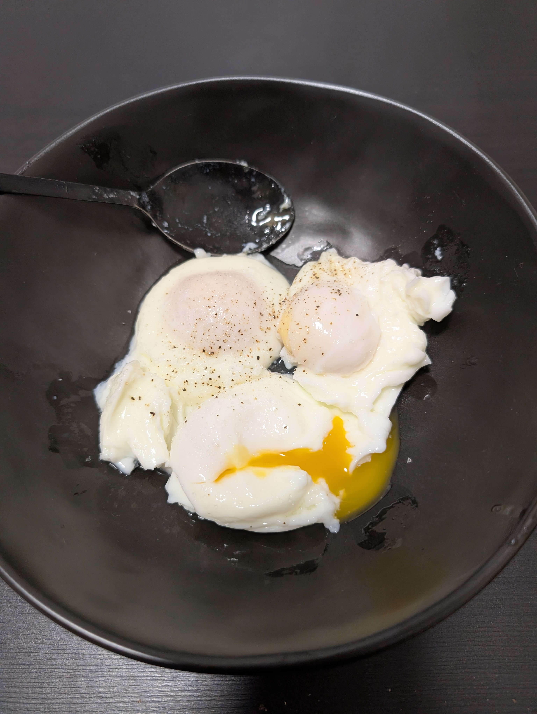

---
tags:
  - eggs
category:
  - cooking
country: 
duration_min: 3.5
todo: false
theme: tre_light
marp: false
paginate: false
aliases: 
acknowledgements:
  - Reiner Schmidt
links:
---

# Poached Egg

|Ingredient|Amount (4 portions)|
| :- | :- |
|egg|4|
|water|-|
|salt|-|

## Recipe
1. add some **salt** to water
2. boil **water**
3. turn down heat
4. crack-open **egg** and put in ladle/dipper
    1. make sure eggyolk stays intact!
5. dip ladle (**egg**) in water
    1. make sure eggyolk stays intact!
6. leave **egg** in water for 3-4min
    1. eggwhite solidified
    2. eggyolk still oozy

## Notes
* if cooking on higher altitudes (mountain hut), let sit for a little longer
