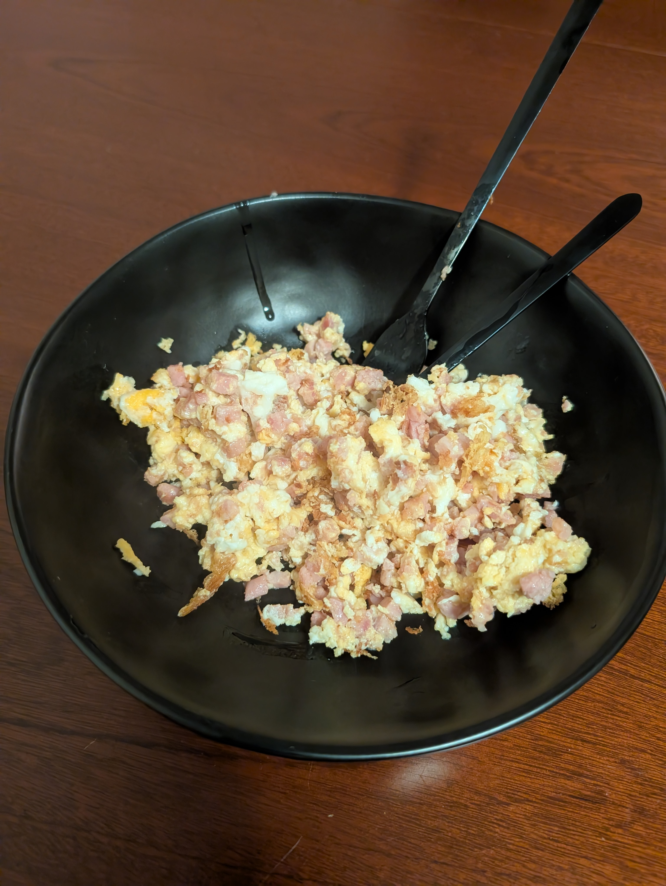

---
tags:
  - eggs
category:
  - cooking
country:
duration_min:
todo: false
theme: tre_light
marp: false
paginate: false
aliases:
acknowledgements:
links:
---

# Scrambled Egg

|Ingredient|Amount (4 portions)|
| :- | :- |
|garlic|4 cloves|
|onion|2|
|bacon cubes|0 g|
|bread|0|
|butter|0 g|
|oil|0 mL|
|pepper|0 g|
|salt|0 g|
|vegetables|0|

## Ingredients

## Recipe
1. chop **onions**, **garlic**
1. (if **bacon cubes**)
    1. roast in pan
1. add **oil** to pan
1. add **garlic**, **onions** into pan
    1. roast gently
1. add **egg** and **parmesan** into pan
1. mix everything together
1. season with **salt** and **pepper**

## Side
* dark bread

## Notes
* also other **vegetables** can be added
