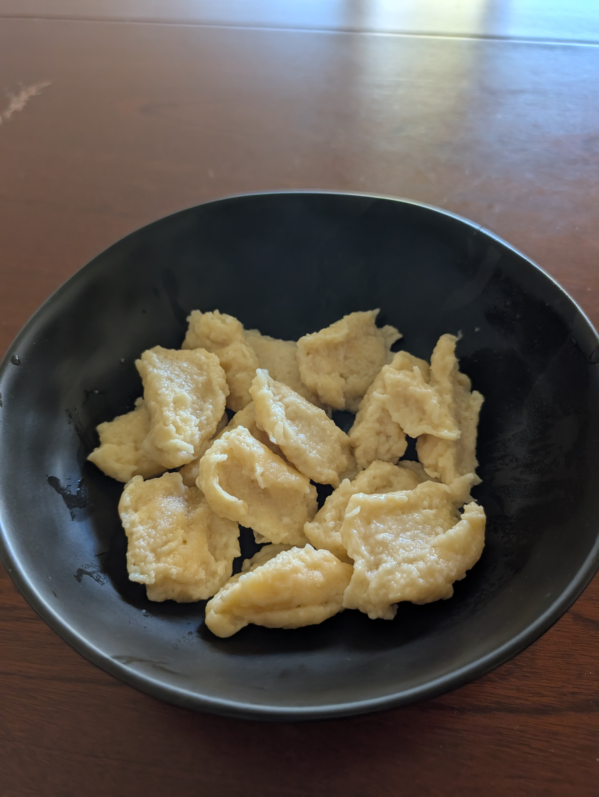

---
tags:
  - base
category:
  - cooking
country:
duration_min:
todo: false
theme: tre_light
marp: false
paginate: false
aliases:
acknowledgements:
links:
---

# Eiernockerl

|Ingredient|Amount (4 portions)|
| :- | :- |
|flour|300 g|
|milk|150 mL|
|butter|50 g|
|egg|3|
|salt|0.4 g|
|water|-|

## Recipe

1. melt **butter**
2. mix with **milk**, **salt**, **eggs**
3. mix in **flour**
    1. add **milk** if dough is to viscous    
4. boil salted **water** in pot
    1. add dough via
        2. forming small bunches with 2 tablespoons
    2. take dough out of **water** when swimming to surface
    
## Notes
