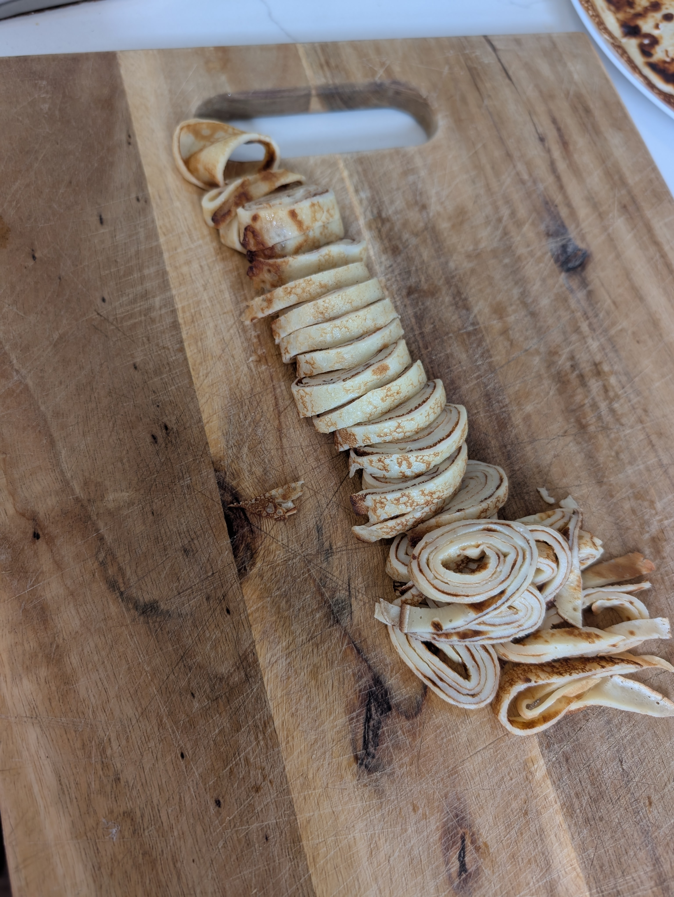

---
tags:
  - soup
  - base
category:
  - cooking
  - tradition
country:
  - austria
duration_min: 
todo: false
theme: tre_light
marp: false
paginate: false
aliases: 
acknowledgements: 
links:
---

# Frittaten

|Ingredient|Amount (4 portions)|
| :- | :- |
|milk|400 mL|
|flour|200 g|
|egg|2|
|salt|0.32 g|
|butter|-|
|oil|-|
|sparkling water|-|

## Recipe
1. prepare [Palatschinken](Palatschinken.md)
2. roll [Palatschinken](Palatschinken.md)
	1. you can stack multiple and roll them together for efficiency
3. cut rolled [Palatschinken](Palatschinken.md) slices of about $3\,mm$ width

## Notes
