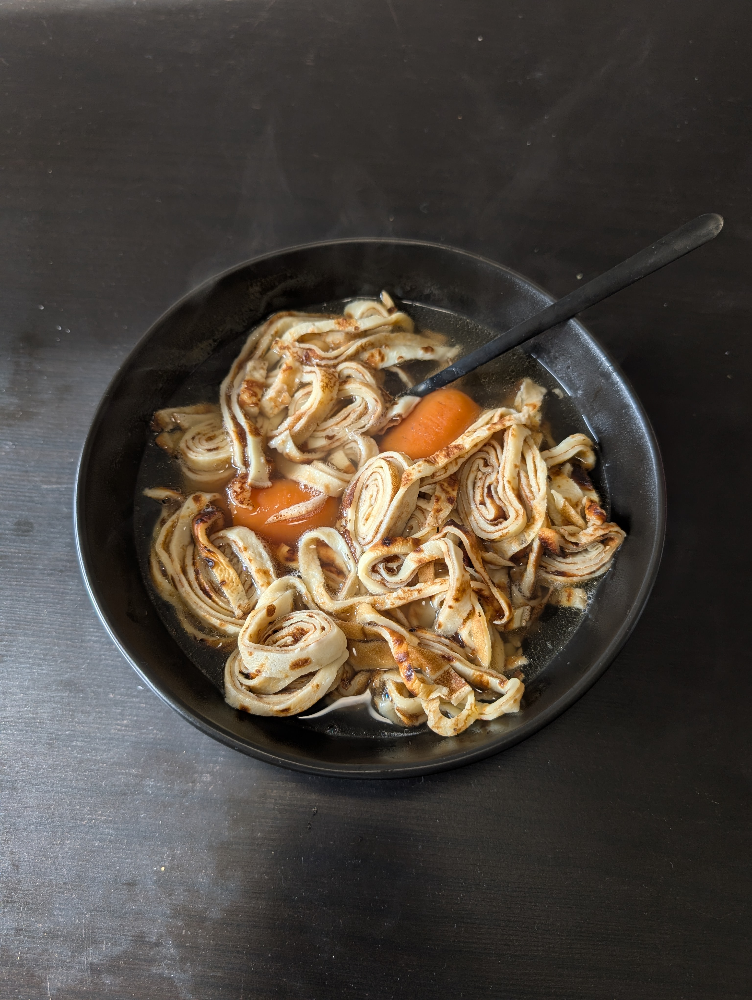

---
tags:
  - soup
aliases:
  - Flädlesuppe
category:
  - tradition
country:
  - austria
duration_min: 
todo: false
acknowledgements: 
links: 
theme: tre_light
marp: false
paginate: false
---

# Fittatensuppe

|Ingredient|Amount (4 portions)|
| :- | :- |
|milk|400 mL|
|flour|200 g|
|egg|2|
|salt|0.32 g|
|butter|-|
|oil|-|
|sparkling water|-|
|water|2000mL|
|beef bones|660g|
|meat (beef)|660g|
|bay leaf|1|
|onion|1|
|soup vegetables|1|
|juniper berries|0|
|pepper|0|

## Recipe
1. prepare [Soup_Beef](Soup_Beef.md)
2. prepare [Frittaten](Frittaten.md)
3. put [Frittaten](Frittaten.md) into bowl
4. pour [Soup_Beef](Soup_Beef.md) atop
5. garnish with **chives**

## Notes
* you can also use other kinds of soup ([Soup_Chicken](Soup_Chicken.md), [Soup_Vegetables](Soup_Vegetables.md)), however, [Soup_Beef](Soup_Beef.md) is the traditional way
