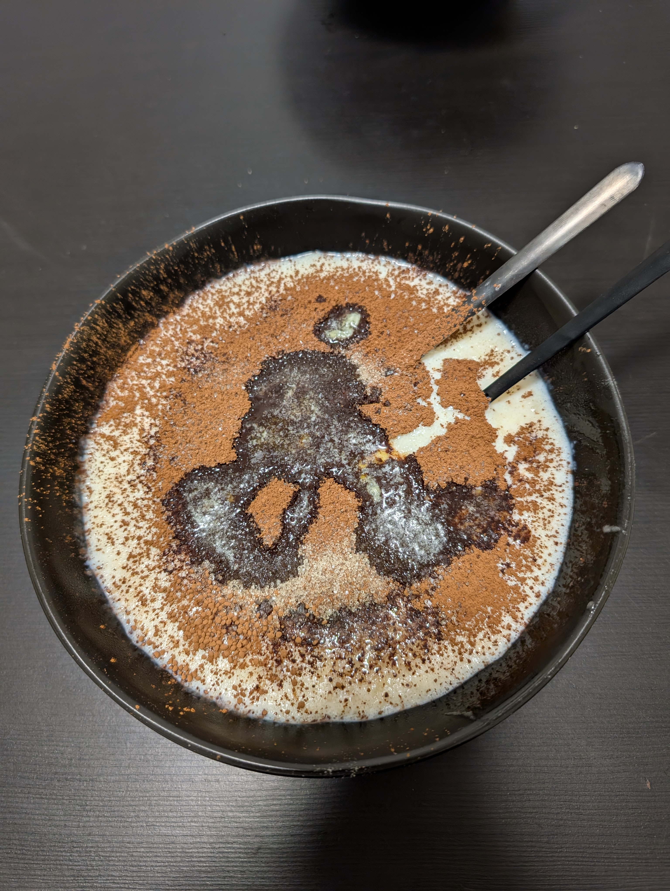

---
tags:
  - sweet
category:
  - cooking
country: 
duration_min: 
todo: false
theme: tre_light
marp: false
paginate: false
aliases: 
acknowledgements: 
links:
---

# Grießbrei

|Ingredient|Amount (4 portions)|
| :- | :- |
|milk|100 mL|
|farina|20 g|
|banana|4|
|cocoa|-|
|sugar|-|
|butter|-|

## Recipe
1. boil **milk** in pot
2. in meantime
    1. squish **banana** using fork
3. when boiling, add **farina**/**semolina**
    2. mix continuously with whisk
    3. once well mixed slowly add squished **banana**
4. continue whisking gently until mixture boils once again
5. turn down heat
6. once mixture thickens slightly: pour in bowl
7. add (unsweetened) **cocoa** and **sugar** according to liking
8. let cool for more viscous result, eat right away for more liquid

## Notes
* preferably use older **banana** as they have a lot of natural sweetness to them