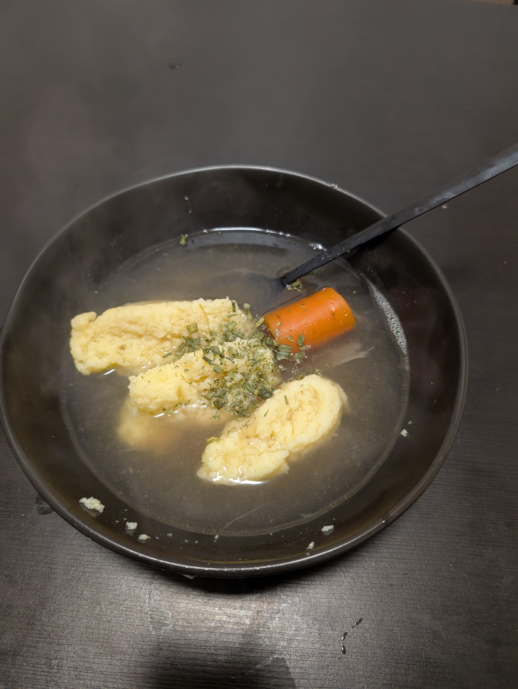

---
tags:
  - soup
  - tradition
aliases:
category:
  - tradition
country:
  - austria
duration_min:
todo: false
acknowledgements:
links:
theme: tre_light
marp: false
paginate: false
---

# Grießnockerlsuppe

|Ingredient|Amount (4 portions)|
| :- | :- |
|farina|65 g|
|butter|30 g|
|egg|1|
|nutmeg|0.5 pinch|
|salt|0.5 g|
|water|2000 mL|
|beef bones|660 g|
|meat (beef)|660 g|
|bay leaf|1|
|onion|1|
|soup vegetables|1|
|juniper berries|0|
|pepper|0|

## Recipe
1. make [Griessnockerl](Griessnockerl.md)
2. serve in soup of choice
	1. [Soup_Vegetables](Soup_Vegetables.md)
	2. [Soup_Beef](Soup_Beef.md)
	3. [Soup_Chicken](Soup_Chicken.md)

## Notes
* ingredients for [Soup_Beef](Soup_Beef.md)