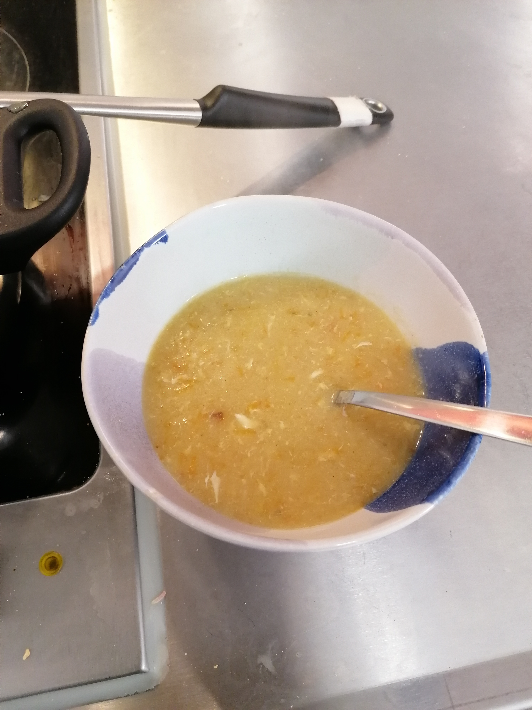

---
tags:
  - soup
  - ill
  - vegetarian
category: cooking
country:
duration_min: 30
todo: false

theme: tre_light
marp: false
paginate: false
---

# Grießsuppe (Semolina Soup)

---

## Ingredients

## Recipe
1. finely chop **onion**
1. heat **butter** in pot
1. add **onion**
    1. roast in **butter**
1. add **farina**
    1. roast alongside until slightly brown-ish
1. add **water**
1. season with **soup-spice**, **salt**
1. let simmer without lid for ~5min
    1. stir from time to time
1. grate **carrot**
    1. add to soup
    1. cook for another ~5min
1. slightly whisk **egg**
    1. slowly infuse into soup
    1. stir well
1. chop **parsley**
1. serve with **parsley** sprinkled on top

## Notes
