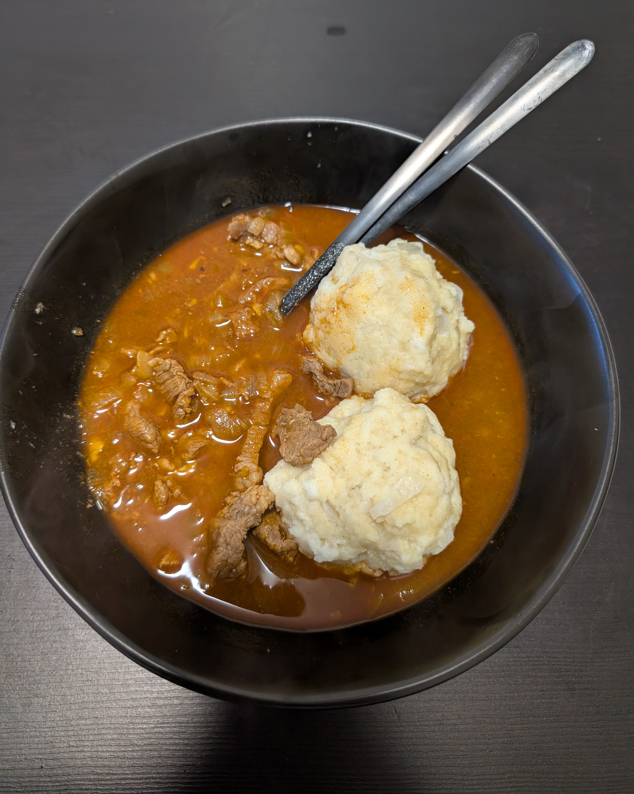

---
tags:
  - soup
category:
  - cooking
country:
  - austria
  - hungary
duration_min: 
todo: false
theme: tre_light
marp: false
paginate: false
aliases: 
acknowledgements: 
links:
---

# Gulasch (Beef)

|Ingredient|Amount (4 portions)|
| :- | :- |
|water|1500 mL|
|meat (beef;shoulder)|1000 g|
|butter|50 g|
|garlic|6 cloves|
|onion|3|
|tomato paste|2 tbsp|
|caraway|-|
|flour|-|
|marjoram|-|
|pepper|-|
|pepper spice|-|
|salt|-|
|soup seasoning|-|
|vinegar|-|

## Recipe

1. prepare [beef soup](./Soup_Beef.md)
    1. alternatively mix **soup spice (beef)** with **water**
1. cut **meat** into 2cm cubes
1. peel and chop **onion**, **garlic**
1. roast **onion** in pot using **butter**
1. add **meat** to **onion**
    1. season **meat** with **salt**, **pepper**
    1. roast until grey all around
1. add **tomato paste**
    1. roast along to get rid of acid
1. add **garlic**, **pepper spice**
    1. roast along for short time (too long leads to bitterness)
1. deglace with a shot of **vinegar** (alternatively **wine (red)**)
1. add [beef soup](./Soup_Beef.md) and season with **caraway**, **marjoram**
1. let simmer for 1-1.5hours
1. add **flour** to bind if necessary 

## Side
* [semmel knödel](Semmelknoedel.md)
* **bread (dark)**
* **bread (white)**

## Notes
* [https://www.gutekueche.at/rindsgulasch-rezept-4460 ](https://www.gutekueche.at/rindsgulasch-rezept-4460 )