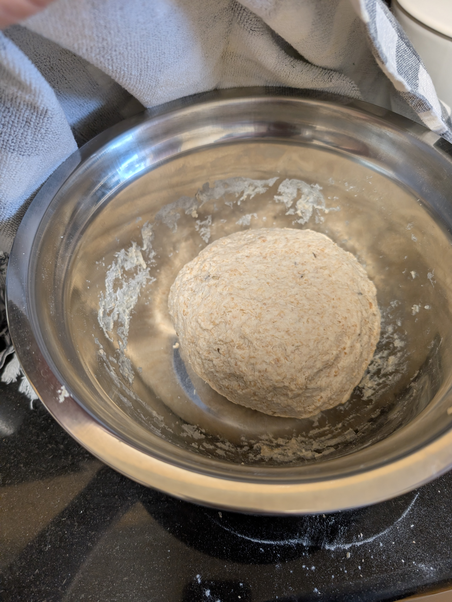
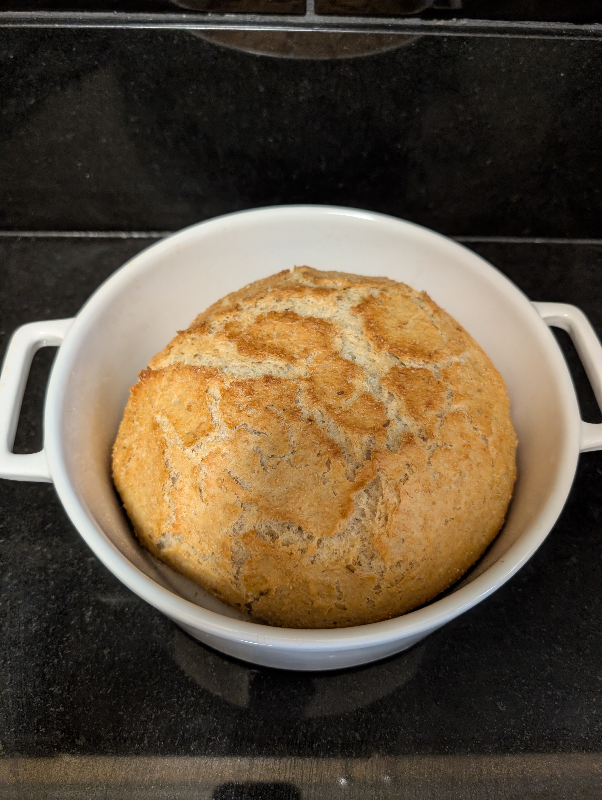
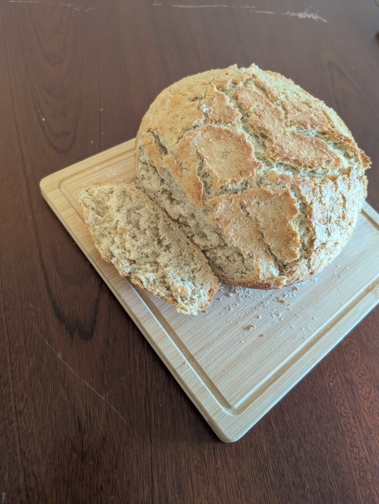

---
tags:
aliases:
category:
country:
duration_min:
todo: false
acknowledgements:
links:
  - https://www.gutekueche.at/kaertner-hausbrot-rezept-7220
theme: tre_light
marp: false
paginate: false
---

# Kärntner Hausbrot

||||
| :-: | :-: | :-: |
||||

|Ingredient|Amount (4 portions)|
| :- | :- |
|flour (rye)|450 g|
|sourdough starter|150 g|
|caraway|1 tsp|
|salt|1 tsp|
|water|300 mL|
|flour (wheat)|50 g|
|yeast (dry)|7 g|
|aniseed|1 g|
|fennel seeds|1 g|

## Recipe

### Dough
1. mix **flour (rye)**, **flour (wheat)**, **sourdough starter** ([SourDoughStarter](SourDoughStarter.md)), **yeast**, **salt**, **caraway**, **aniseed**, **fennel seeds**, **water**
	1. slowly knead to dough (ideally with *dough-hook*, by hand also works)
2. knead by hand until not sticky anymore
	1. should still be firm
3. cover bowl with cloth
	1. let sit for $\approx \pu{1h}$

### Baking
1. preheat oven to $\pu{225^\circ C}$ [Conventional](OvenSettings.md#Conventional)
2. place cast-iron pot into oven (heat bowl)
3. place [Dough](#Dough) into cast-iron pot
	1. spray with water
	2. close lid (to ensure moisture stays inside)
4. put back in oven
5. *(place heat-resistant bowl with **water** into oven)*
6. bake [Dough](#Dough) for $\pu{15min}$
7. add expansion cut (cut across the loaf to make sure it can expand)
8. reduce heat to $\pu{180^\circ C}$ for $\pu{45min}$

## Notes
* **water** ensures that bread does not get dry while baking
