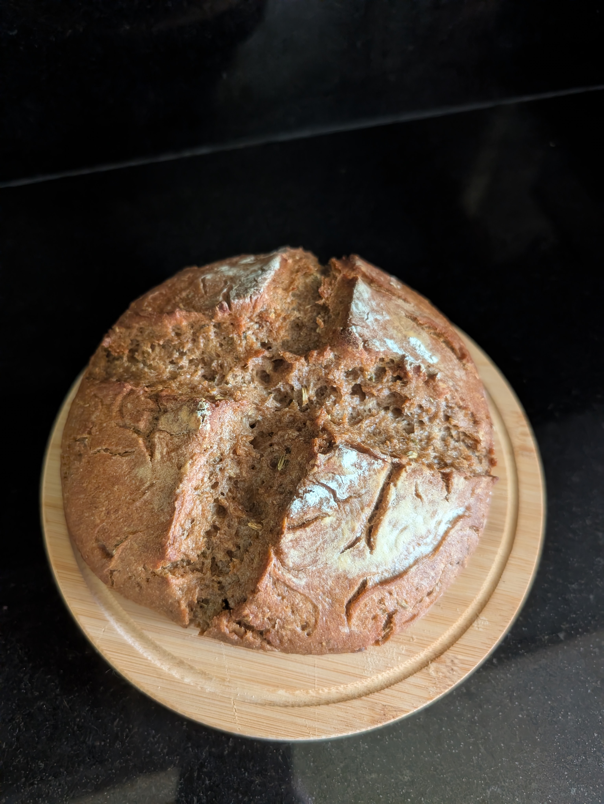
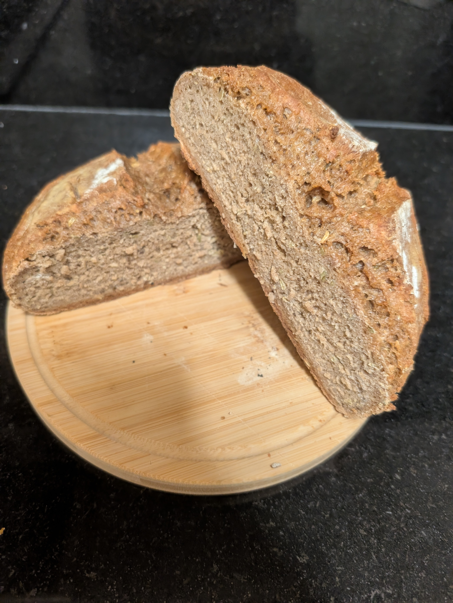
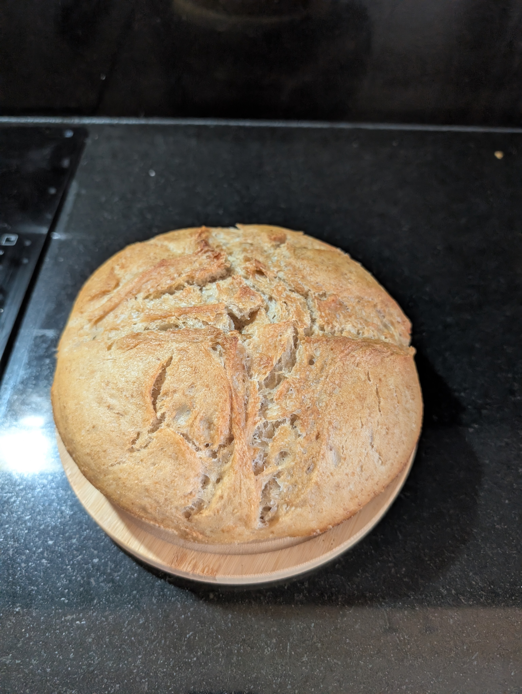
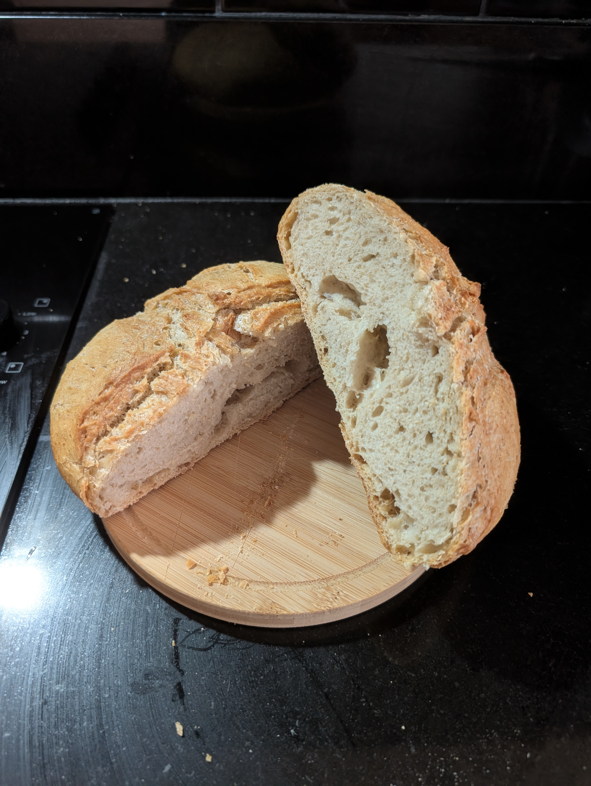

---
tags:
  - baking
  - bread
  - base
aliases:
category:
country:
duration_min:
todo: false
acknowledgements:
  - Reiner Schmidt
  - Elisabeth Gorgasser
links:
  - https://www.gutekueche.at/kaertner-hausbrot-rezept-7220
theme: tre_dark
marp: false
paginate: false
---

# Kärntner Hausbrot

|     |     |     |
| --- | --- | --- |
|     |     |     |
||||

* see this google sheet for exemplary  baking schedules: [https://docs.google.com/spreadsheets/d/1yH_iM4KSYZGnBezECPnpf_osN13lCK4FjuAf3yHS4rE/edit?usp=sharing](https://docs.google.com/spreadsheets/d/1yH_iM4KSYZGnBezECPnpf_osN13lCK4FjuAf3yHS4rE/edit?usp=sharing)

|Ingredient|Amount (4 portions)|
| :- | :- |
|flour (rye)|300 g|
|water|225 mL|
|sourdough starter|100 g|
|flour (wheat)|50 g|
|[yeast (dry)]|[7 g]|
|aniseed|1 g|
|caraway|1 tsp|
|fennel seeds|1 g|
|salt|1 tsp|

* **yeast (dry)** is optional
 * all images shown in this recipe are from attempts without using yeast

## Recipe

### Reviving Starter (optional)
> Only necessary when [SourDoughStarter](SourDoughStarter.md) stored in fridge

1. take starter out of fridge
2. [Feeding](#Feeding)
3. let sit for $\pu{12h}-\pu{24h}$
4. once doubled in size, ready to use for baking

### Dough

#### Initial Mixing
1. add **water (handwarm)**, **sourdough starter** ([SourDoughStarter](SourDoughStarter.md)) to in bowl
	1. mix well until **sourdough starter** dissolved
2. add **flour (rye)**, **flour (wheat)**, **yeast (dry)**, **aniseed**, **caraway**, **fennel seeds**, **salt**
3. pour dough onto a floured surface
4. slowly knead to dough (I usually do around $\pu{10min}$)
	1. dough should still be firm
	 2. dough can still be slightly sticky
5. clean mixing bowl and cover bottom with a little bit of flour
	 1. this ensures that the dough can easily be dropped out of the bowl after [Bulk Fermentation](#bulk-fermentation)
6. shape dough in roundish shape and place in bowl

#### Bulk Fermentation
1. cover bowl with damp cloth
2. let sit for $\ge \pu{12h}$
	1. I dampen the cloth with warm water and let the bowl sit in the closed oven in case it is cold outside
3. (optional: apply [Stretch and Fold](Bread_SourDough.md#Stretch%20and%20Fold))

#### Shaping
1. sprinkle flour along edges of dough
2. with rubber spatula scrape dough off wall of bowl
3. turn dough out onto floured surface
4. knead by hand (optionally include an additional $\pu{2tbsp}-\pu{3tbsp}$ of flour - I usually don't)
5. gently from into ball by cupping hands below rim of [Dough](#Dough)
    1. goal: surface tension

#### Proofing/Bench Rest
1. place dough ball into proofing basket with *seam-side down*
	1. bowl also works
		1. in that case cover with slightly damp  kitchen towel
2. let sit for another $\pu{2h}$
3. done when slightly puffy but _NOT_ doubled in size

### Baking
1. $\pu{30min}$ before [Proofing](#Proofing) is completed
	1. place cast-iron pot including lid onto lowest rack in oven (heat bowl)
  2. in Reiners words: "the cast-iron pot has to be *knitteheiß*"
	2. preheat oven to $\pu{250^\circ C}$ [Conventional](OvenSettings.md#Conventional) 
3. prepare the dough
	1. place floured wooden cutting board on counter
	2. turn dough onto floured cutting board
	3. add extension cut to [Dough](#Dough)
		1. with sharp knife/razor blade: cut top of the dough in a cross-shape
		2. this allows the [Dough](#Dough) to expand more freely thus, leading to a more fluffy inside
4. slide [Dough](#Dough) off of  board  with both hands
5. place [Dough](#Dough) into cast-iron pot
	1. spray with water
	2. quickly close lid (to ensure moisture stays inside)
6. put back in oven
7. reduce heat to $\pu{225^\circ C}$
8. bake [Dough](#Dough) for $\pu{50min}$
9. depending on desired crust-darkness, bake for another $\pu{10min}-\pu{15min}$ *without* lid

### Cool Down
* before slicing let rest for $\pu{1h}$
	* prevents gummy texture
		* lets steam escape from inside
	* makes sure aromas from crust are present in inside as well

## Notes
* **water** ensures that
	* bread does not get dry while baking
	* crust doesn't form to early so bread can expand
* alternatives for flour (rye)
	* pretty much anything but all purpose flour
	* I use wholegrain
* all images shown in this recipe are from attempts*without* **yeast (dry)**
 * in case your starter is not very strong yet, I still recommend adding a bit of yeast to help with getting fluffy breads
	* yeast will not influence flavor

## Variations
* all variations follow [Recipe](#Recipe)
	* results change based on ingredients, of course

### Reiner Schmidts Original
- [ ] TODO: try baking

|Ingredient|Amount|
| --- | --- |
|sourdough starter|150 g|
|flour (rye)|50 g|
|flour (wheat) |350 g|
|water (handwarm)|200g|
|yeast (dry)|1.5 tsp|
|diastatic malt powder|1.5 tsp|
|salt|0.75 tsp|

### White Bread

|     |     |
| --- | --- |
|||

|Ingredient|Amount (4 portions)|
| :- | :- |
|flour (wholemeal)|50 g|
|water|225 mL|
|sourdough starter|100 g|
|flour (wheat)|300 g|
|yeast (dry)|7 g|
|salt|1 tsp|