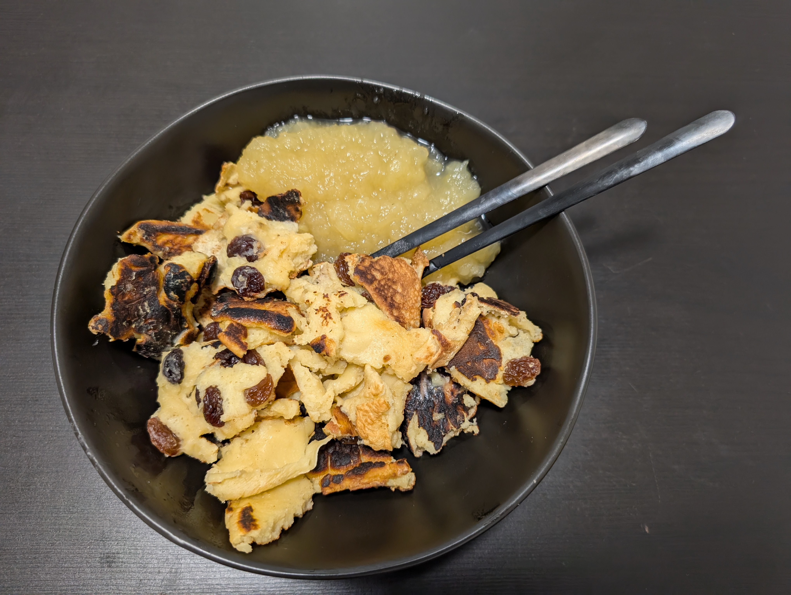

---
tags:
  - sweet
aliases: 
category:
  - sweet
country:
  - austria
duration_min: 
todo: false
acknowledgements:
  - Oma Berni
links: 
theme: tre_light
marp: false
paginate: false
---

# Kaiserschmarrn

|Ingredient|Amount (4 portions)|
| :- | :- |
|milk|350 mL|
|flour|270 g|
|egg|5|
|butter|-|
|raisin|-|
|salt|-|
|sugar|-|

## Recipe

### Dough
1. mix flour, eggs, sugar, salt, raisins, milk
2. optionally add a little bit of sparkling water
	1. introduces more softness

### Finish
1. heat up pan until #leidenfrost effect reached
2. add butter
3. add [Dough](#Dough)
4. fry for short time on both sides
5. optional
	1. heat up on oven for 10 min
6. rip finished result into pieces
7. add powder sugar

## Notes
* commonly served with [Apfelmus](Apfelmus)
