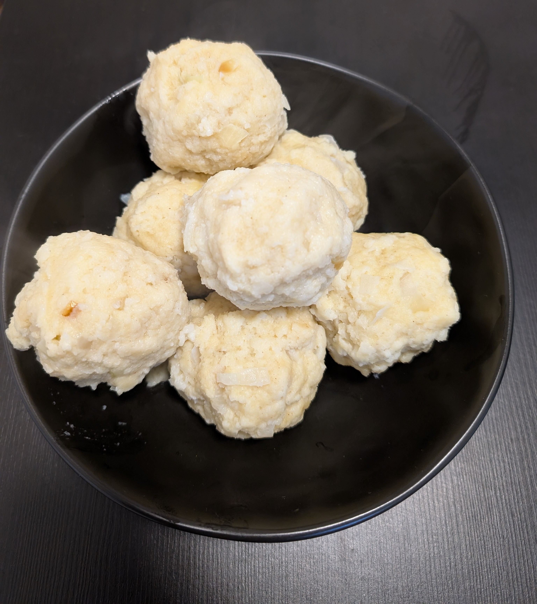

---
tags:
  - base
  - knodel
category:
  - cooking
country:
  - austria
duration_min: 
todo: false
theme: tre_light
marp: false
paginate: false
---

# Knödel (Semmel)

## Ingredients

## Recipe

### dough
1. chop **onions**
2. roast **onions** in **butter**
3. add **nutmeg**, **parsley**, **salt**
4. let **foam** once
5. mix **breadcrumb**, **flour**, **salt**, **onions**
6. mix **milk** with **egg**
7. add *milk-egg* mixture to rest
8. let rest for a few minutes

### cooking the knödel
1. add **salt** to **water** and bring to a boil
2. from [dough](#dough) form knödel with hands
3. gently place in cooking water
4. let sit for about 10 min

## Notes
