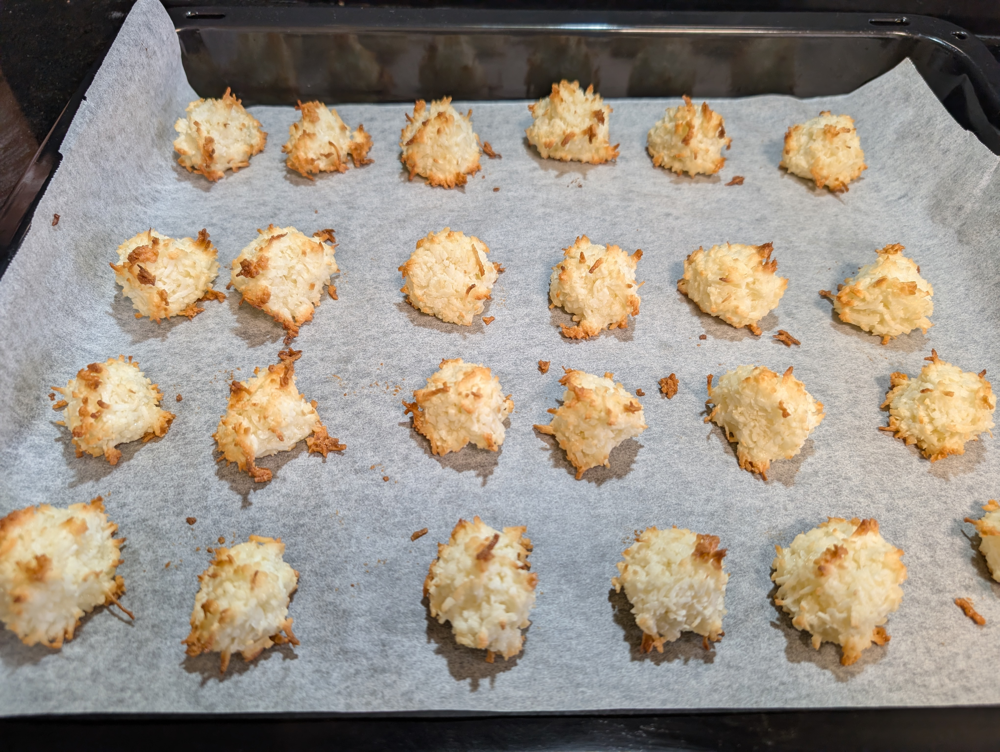

---
tags:
  - baking
  - christmas
aliases:
country:
  - austria
duration_min: 90
todo: false
acknowledgements:
  - Oma Berni
links:
theme: tre_light
marp: false
paginate: false
---

# Kokosbusserl

|Ingredient|Amount (70 pieces)|Alternative Units|
| :- | :- | :- |
|shredded coconut|440 g|
|sugar (icing)|160 g|
|marzipan|260 g|
|egg|7|
|lemon (bio)|0.5|
|rum|1 shot|
|[honey]|2 tbsp|

## Recipe

### Dough
1. extract egg-white from **eggs**
2. grate **marzipan**
3. beat **egg-white** until stiff
4. add **marzipan**
5. add **sugar (icing)**/**honey**
6. add **shredded coconut**
7. add strained juice of **lemon**
8. add **rum**
9. mix well

> [Marzipan](Marzipan.md) is grandma's secret ingredient. It ensures that the [Kokosbusserl](Kokosbusserl.md) stay soft and don't become hard like a rock after a few days.

### Baking
1. preheat oven to $180^\circ\mathrm{C}$ [Fan-Forced](OvenSettings.md#Fan-Forced)
2. add parchment paper to baking tray
3. form small heaps from [Dough](#Dough)
	1. make sure there's at least $1\,\mathrm{cm}$ distance between the heaps
	 2. make sure to wash your hands frequently while handling the [Dough](#Dough) to avoid stickiness
4. bake for $\approx 5\,\mathrm{min}$
5. turn baking tray by $180^\circ$
6. bake $\approx 5\,\mathrm{min}$
	1. the [Kokosbusserl](Kokosbusserl.md) should be slightly soft when coming out of the oven
7. let cool a bit before placing in storage box
	1. The [Kokosbusserl](Kokosbusserl.md) will harden slightly

## Notes
* if you're feeling fancy make [Marzipan](Marzipan.md) yourself
* you can substitute **sugar (icing)** with $2\,\mathrm{tbsp}$ **honey**
