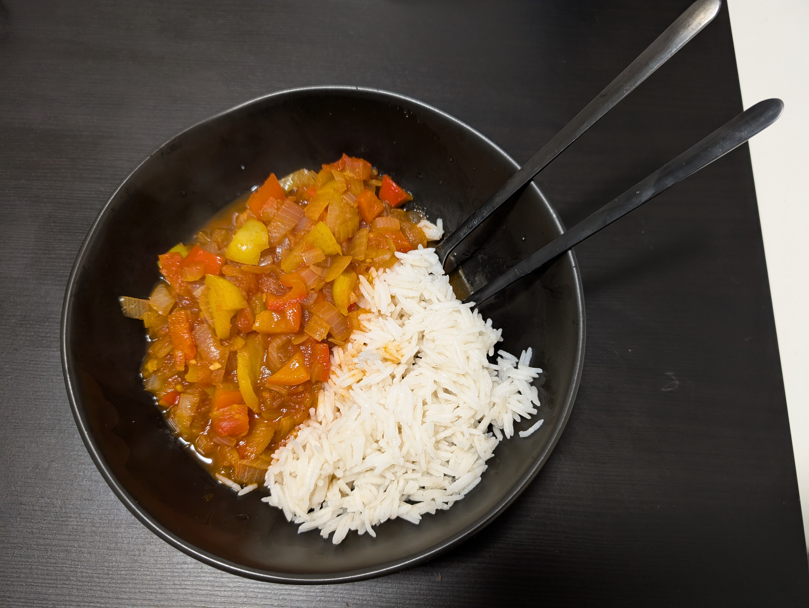

---
tags:
  - stew
  - vegetarian
category:
  - cooking
country:
  - austria
  - hungary
duration_min: 
todo: false
theme: tre_light
marp: false
paginate: false
aliases: 
ingredients:
  - water
  - tomato
  - spring onion
  - capsicum
  - garlic
  - tomato paste
  - sugar
  - oil
  - pepper
  - pepper spice
  - salt
amounts:
  - 100mL
  - "3"
  - "2"
  - 20g
  - 2cloves
  - 1.5tbsp
  - 0.5tbsp
  - "0"
  - "0"
  - "0"
  - "0"
acknowledgements: 
links:
  - https://www.gutekueche.at/letscho-rezept-12683
---

# Letscho

## Recipe
1. peel and chop **onions**, **garlic**
2. chop **capsicum** into small pieces
3. blanch and consecutively peel **tomatoes**
4. roast **onion**, **garlic**
	1. add **garlic** later such that it does not go bitter
5. add **tomatoes**, **capsicum**, **tomato paste**
6. mix well and add a little bit of **water**
7. let boil once, then simmer for $\approx 25\,min$.
	1. stir every now and again
8. season with **salt**, **pepper**, **pepper spice**, **sugar** as you go

## Side
* typically served without side or [Rice](Rice.md)
* also [Couscous](Couscous.md) 
* often [Letscho](Letscho.md) is also used as a side for other dishes

## Notes
