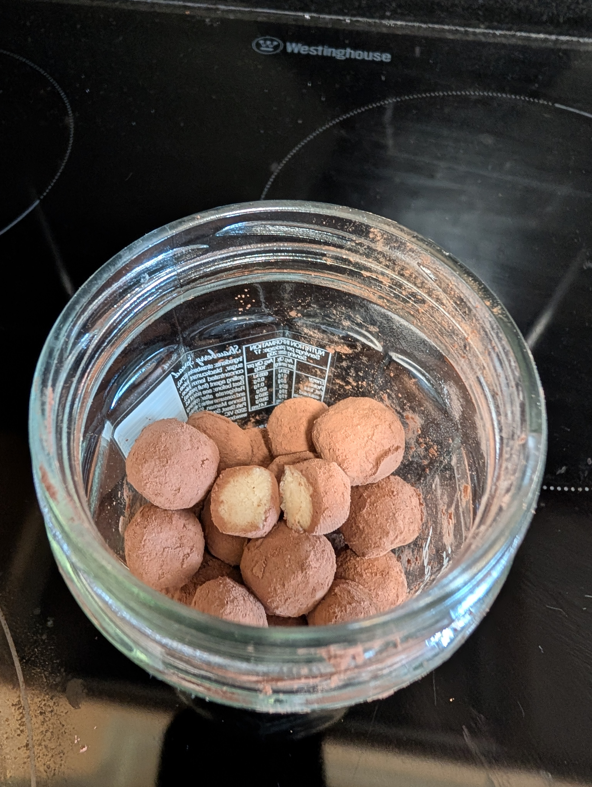

---
tags:
  - sweet
aliases:
country:
  - austria
  - germany
duration_min: 15
todo: false
acknowledgements:
links:
theme: tre_light
marp: false
paginate: false
---

# Marzipankartoffeln

|Ingredient|Amount (30 pieces)|Alternative Units|
| :- | :- | :- |
|marzipan|240 g|
|cocoa|0|

> try making [Marzipan](Marzipan.md) yourself

## Recipe
1. roll [Marzipan](Marzipan.md) into cylinder of $\approx 1\,\mathrm{cm}$ diameter
2. cut discs with $\approx 0.5\,\mathrm{cm}$ thickness off the cylinder
3. roll the discs into spheres
4. roll the spheres in **cocoa** until the entire surface is covered

## Notes
* you can mix **cocoa** with a bit of **cinnamon**
* I usually use $100\%$ **cocoa**
	* in that case you can add a tiny bit of sugar if you want
	* generally the [Marzipan](Marzipan.md) is more than sweet enough though
