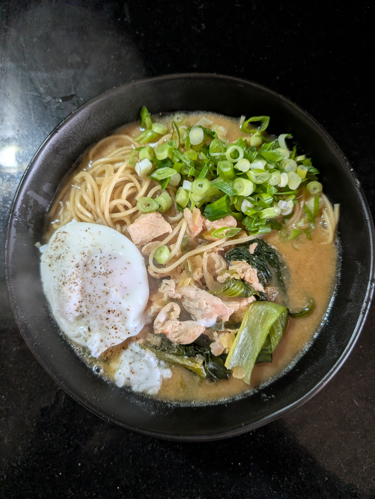

---
tags:
  - soup
category:
  - cooking
country:
  - japan
duration_min: 35
todo: true
theme: tre_light
marp: false
paginate: false
aliases:
acknowledgements:
links:
  - https://www.andy-cooks.com/blogs/recipes/miso-ramen
  - https://www.justonecookbook.com/homemade-chashu-miso-ramen/
---

# Miso ramen

|Ingredient|Amount (3 portions)|Alternative Units|
| :- | :- |
|water|700 mL|
|ramen noodles|270 g|
|ginger|200 g|
|sake|15 mL|
|spring onion|6|
|miso paste|5 tbsp|
|egg|3|
|garlic|3 cloves|
|shallot|3|
|sesame seeds|1.5 tbsp|
|bok choi|1|
|chicken breast|0.7 kg|
|sugar|0.5 tbsp|
|oil (sesame)|0 mL|
|pepper|-|
|salt|-|

* type of Ramen based on [MisoPaste](MisoPaste.md)
	* fermented soy-bean paste

## Recipe

### Prep
1. mince **garlic**
2. finely chop **shallot**, **ginger**
3. slightly grind $\frac{1}{2}$ of **sesame seeds**
4. dice **chicken breast** in bite-sized pieces
5. cook **bok choi**
6. cut **spring onion**

### Main
1. preheat pot on medium-low heat
2. add **oil (sesame)**
3. add **garlic**, **shallot**, **ginger**
4. fry until  fragrant
5. add **chicken breast**
6. add $\frac{1}{2}$ of **spring onion**
7. add **miso paste**
	1. mix well making sure it does not burn
8. add ground **sesame seeds**, **sugar**
9. continue mixing
10. add **sake**
11. add **water**
	1. alternatively you can add some kind of stock ([Soup_Chicken](Soup_Chicken.md), [Soup_Vegetables](Soup_Vegetables.md),...) for even more taste
		1. adjust seasoning accordingly if you do so!
12. let simmer on low-medium heat
13. season to taste with **salt**, **pepper**
14. add **bok choi**

### Combining
1.  cook **ramen noodles**
	1. ideally a little less than recommended
		1. this way they can absorb some of the [Main](#Main) you made
2. add **ramen noodles** to bowl
3. pour [Main](#Main) over noodles
4. top with **spring onions**, a little bit of **pepper**
5. add additional toppings of your choice
	1. I usually also add
		1. [Egg_Poached](Egg_Poached.md)

## Notes
* you can substitute **chicken** with any other protein i.e.,
	* **tofu**
	* **pork**
	* **beef**
* you can substitute **oil (sesame)** for other oils (i.e. **oil (canola)** as well
	* but this will decay the deep nutty taste
* you can substitute **sake** for some other kind of acidic liquid
	* i.e., other types of vinegar
* can be stored in fridges for $\approx 3\,\mathrm{d}$

