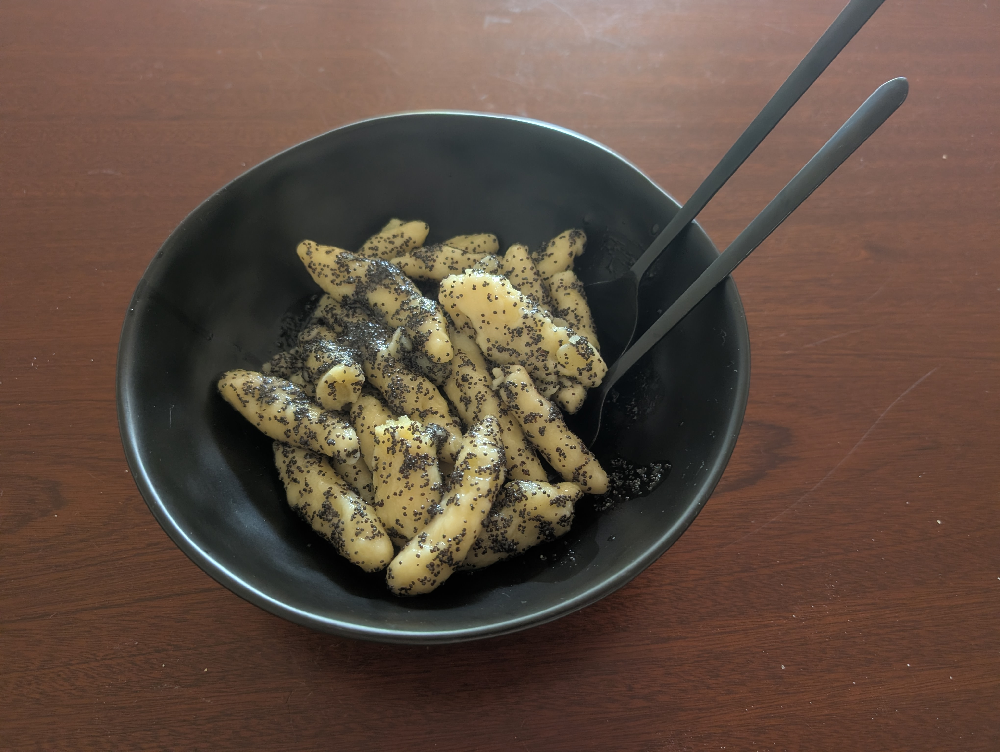

---
tags:
  - sweet
aliases:
category:
country:
  - austria
duration_min: 60
todo: false
acknowledgements:
links:
  - https://www.motioncooking.com/rezept/mohnnudeln/
theme: tre_light
marp: false
paginate: false
---

# Mohn Nudeln

|Ingredient|Amount (4 portions)|Alternative Units|
| :- | :- | :- |
|potato|1200 g|
|flour (wheat)|160 g|
|butter|140 g|
|starch (corn)|100 g|
|farina|80 g|
|sugar (icing)|40 g| 6 tbsp|
|poppy seeds|6 tbsp|
|egg|2|
|salt|2 tsp|

## Recipe
1. prepare [PotatoDough](PotatoDough.md)

### The Noodles

1. from main dough take $\approx\pu{10g}$ pieces
2. in your hand roll (wutzel) the dough-pieces until a cylindrical shape emerges (see image)

### Cooking
1. heat a pot of salted water until boiling gently
2. add [The Noodles](#The%20Noodles)
3. done once rising to the surface

### Mohnzcker
1. grind **poppy-seeds** to fine-ish powder
2. add **poppy-seeds** and **sugar (icing)** in glas
3. shake vigorously until well mixed

###  Merging
1. melt remained of **butter** ($\pu{40g}$) in pan
	1. do not roast the butter, just melt it!
2. add [The Noodles](#The%20Noodles) and mix until all well-covered with **butter**
3. add [Mohnzcker](#Mohnzcker) to the pan and mix some more
4. serve topped with a little more [Mohnzcker](#Mohnzcker)

## Notes
1. process of making the noodle is called "wutzeln"
2. 