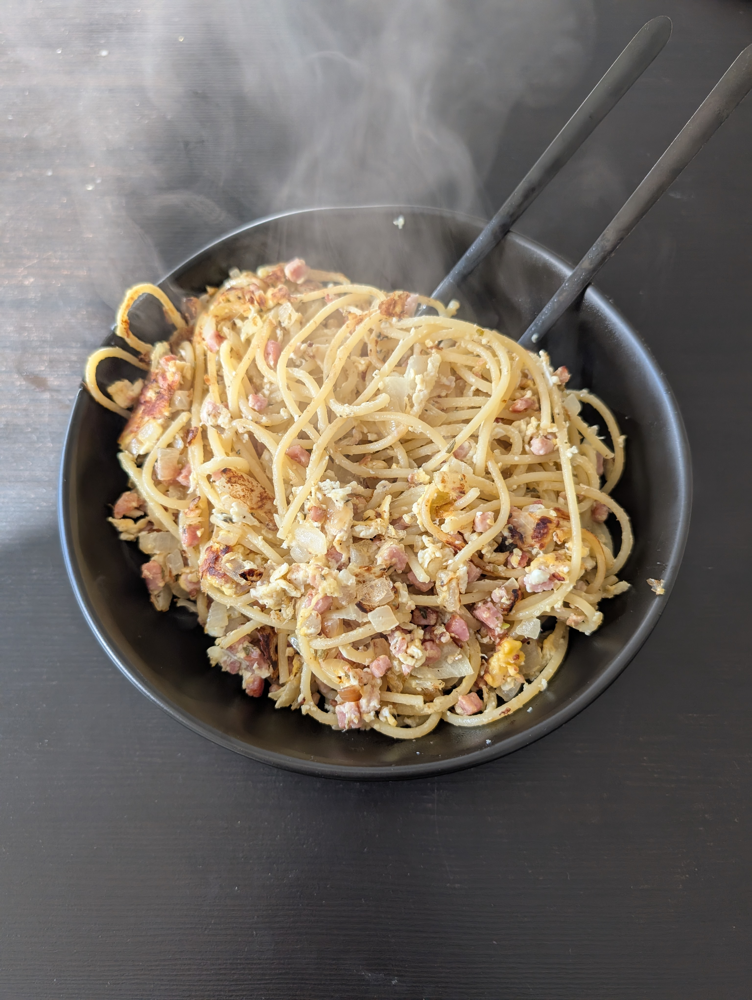

---
tags:
  - pasta
category:
  - cooking
country: 
duration_min: 
todo: false
theme: tre_light
marp: false
paginate: false
aliases: 
acknowledgements: 
links:
---

# Nudel mit Ei

|Ingredient|Amount (4 portions)|
| :- | :- |
|pasta|500 g|
|egg|8|
|bacon cubes|0|
|oil|-|
|parmesan|-|
|pepper|-|
|provence seasoning blend|-|
|salt|-|

## Recipe
1. cook [spaghetti](Pasta.md)
1. roast **bacon cubes** in pan
    1. alternatively also **ham** can be chopped and roasted
1. once [spaghetti](Pasta.md) are al dente
    1. add [spaghetti](Pasta.md) into pan alongside **bacon cubes**
    1. mix pan contents well
1. add **egg** to pan
1. mix pan contents well
1. season with **salt**, **pepper**, **provence seasoning**

## Notes
