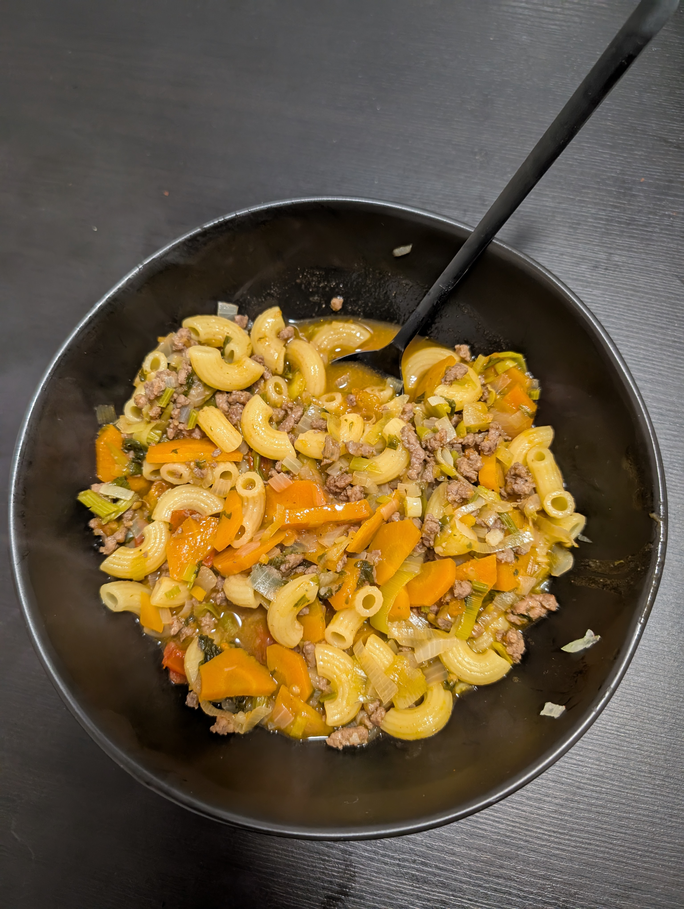

---
tags:
  - soup
  - stew
category:
  - cooking
country: 
duration_min: 
todo: false
theme: tre_light
marp: false
paginate: false
aliases: 
ingredients:
  - water
  - carrot
  - pasta
  - celery
  - onion
  - tomato
  - leek
  - minced meat
  - oil
  - pepper
  - pepper spice
  - salt
  - soup seasoning (vegetables)
  - thyme
amounts:
  - 1000mL
  - 200g
  - 200g
  - 100g
  - "2"
  - "2"
  - "0.5"
  - 0.5kg
  - "0"
  - "0"
  - "0"
  - "0"
  - "0"
  - "0"
acknowledgements:
  - Daniela Steinwender
links:
---

# Nudeleintopf

## Recipe
1. chop **onions**
2. cut
	1. **leek** in half-rings
	2. **carrots** in small pieces
	3. **celery** in cubes
	4. **tomatoes** into cubes
3. heat **oil** in pressure cooker
4. add and roast **minced meat**
5. add **onions** and roast alongside
6. add **vegetables** (**leek**, **carrots**, **celery**, **tomatoes**) and uncooked **pasta**
	1. season with **salt**, **pepper**, **pepper spice**, **thyme** as you go
7. add [Soup_Vegetables](Soup_Vegetables.md)
	1. alternatively add **water** and **soup seasoning** and mix
8. let cook with closed lid until **pasta** is al-dente

## Notes
* if no pressure cooker available also normal pot will do
	* it will just take a little longer
