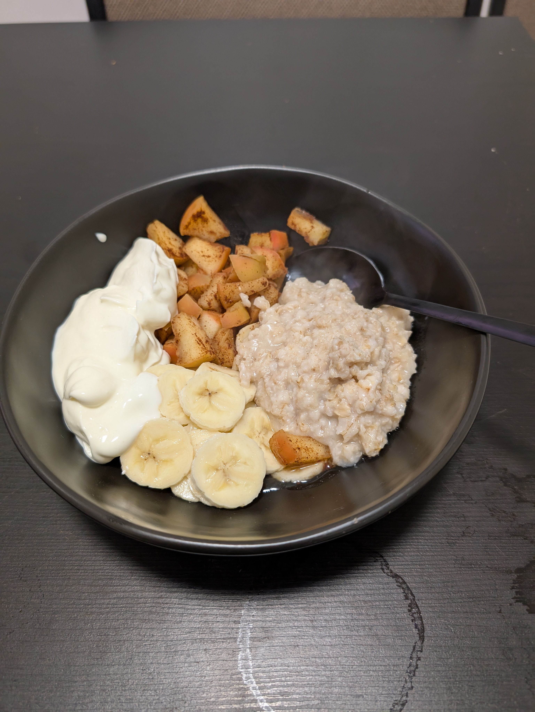

---
tags:
  - sweet
category:
  - cooking
country: 
duration_min: 
todo: false
theme: tre_light
marp: false
paginate: false
aliases: 
acknowledgements: 
links:
---

# Oatmeal

|Ingredient|Amount (4 portions)|
| :- | :- |
|milk|680 mL|
|oat flakes|120 g|
|cocoa|30 g|
|apple|2|
|banana|2|
|oat milk|680 mL|
|cinnamon|-|
|honey|-|
|water|-|
|yoghurt|-|

## Recipe

### Soft Apples
1. chop **apple** and **banana**
1. add a little bit of **water** in a pot
1. add chopped **apple** alongside **cinnamon**, **cocoa**
1. cook until **apple** becomes soft
1. once soft, add **oat flake**
1. let cook briefly (make sure it doesn’t burn)
2. add **milk**, or **oat milk**, or **yoghurt**
3. put in bowl
4. add **banana**, **honey**, **(cocoa)**
5. mix thoroughly

### Crunchy Apples
1. cook **oat flake** together with **oat milk** or **milk**
1. while cooking cut **banana** and **apple** into pieces and add into small bowl
1. add cooked **oat flake** into bowl
2. add **cocoa** and **cinnamon** to taste
3. mix **honey** under the contents of the bowl

## Notes
