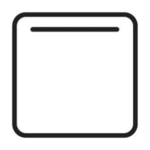

---
tags:
  - notes
aliases: 
category: 
country: 
ingredients: 
amounts: 
duration_min: 
todo: false
acknowledgements: 
links: 
theme: tre_light
marp: false
paginate: false
---

# Oven Settings

## Fan-Forced

* heat from element surrounding fan
* fan to distribute heat
* useful if
	* oven needs heat up quickly
	* multi-shelf
	* reheating
	* roasts

## Conventional

* heat from top and bottom
* more or less even heating
* useful for
	* baking single trays
		* biscuits
		* muffins
		* egg dishes (quiche)

## Fan Assist

* gentler than [Fan-Forced](#Fan-Forced)
* heat from top and bottom
* fan to distribute
* slightly faster cooking time than [Conventional](#Conventional)
* useful if
	* slightly faster cooking time compared to [Conventional](#Conventional) required

## Pizza

* heat from bottom
* heat from fan element
* fan to distribute
* useful where bottom needs to be baked
	* pizza
	* meat-pies
	* pastries

## Fan Grill

* heat from top
* heat from fan
* fan to distribute
* useful for
	* longer cooking times
		* large cuts of meats
		* chicken
	* browning things up top
		* baked vegetables
		* baked potatoes

## Top Heat

* heat from top
* useful for
	* things that need to heat up heat up slower
	* things that need a slight crust up top
		* pies
	
## Bottom Heat

* heat from bottom
* useful for
	* things that need crispy bottom and no burned top
		* pizza
	* slow cooking
* use aluminium trays for even browning

## Grill

* heat only from top
* useful for
	* smaller cuts of meat
		* larger ones are burned without being cooked thorugh