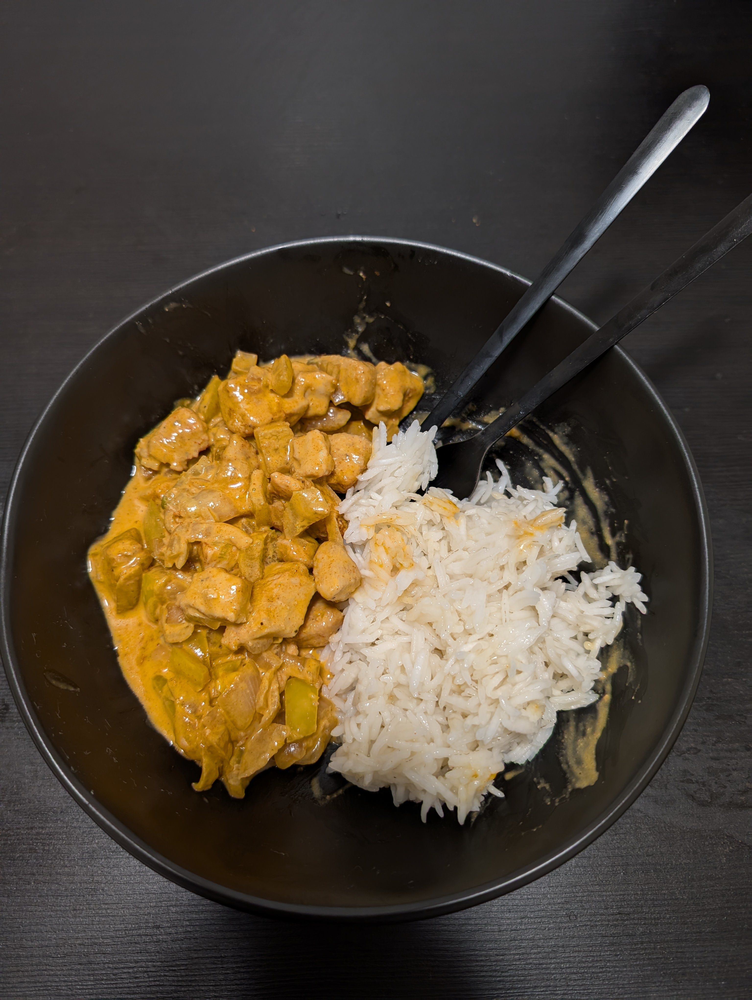

# Paprika Geschnetzeltes

|Ingredient|Amount (4 portions)|
| :- | :- |
|rice|800 g|
|cream|500 mL|
|capsicum|4|
|onion|2|
|chicken breast|1 kg|
|garlic|-|
|oil|-|
|parmesan|-|
|pepper|-|
|pepper spice|-|
|provence seasoning blend|-|
|salt|-|

## Recipe
1. preparation
    1. wash **chicken** breasts
    1. chop **onion**, **garlic** in small pieces
    1. chop **pepper** in bite-sized pieces
    1. chop **chicken** breasts in bite-sized pieces
1. main
    1. heat **oil** in pan
    1. roast **onion**, **garlic** in pan
    1. add chopped **pepper**
    1. add cut **chicken** breasts to roast alongside
        1. season with **salt**, **pepper**, **pepper-powder**
    1. once roasted add **cream**
    1. if sauce not viscous enough
        1. add **parmesan**/**flour**
    1. wait until sauce viscous enough

## Side
* [rice](./Rice.md)
* [spaghetti](Pasta.md)
* [spätzle](./Spaetzle.md)

## Notes

