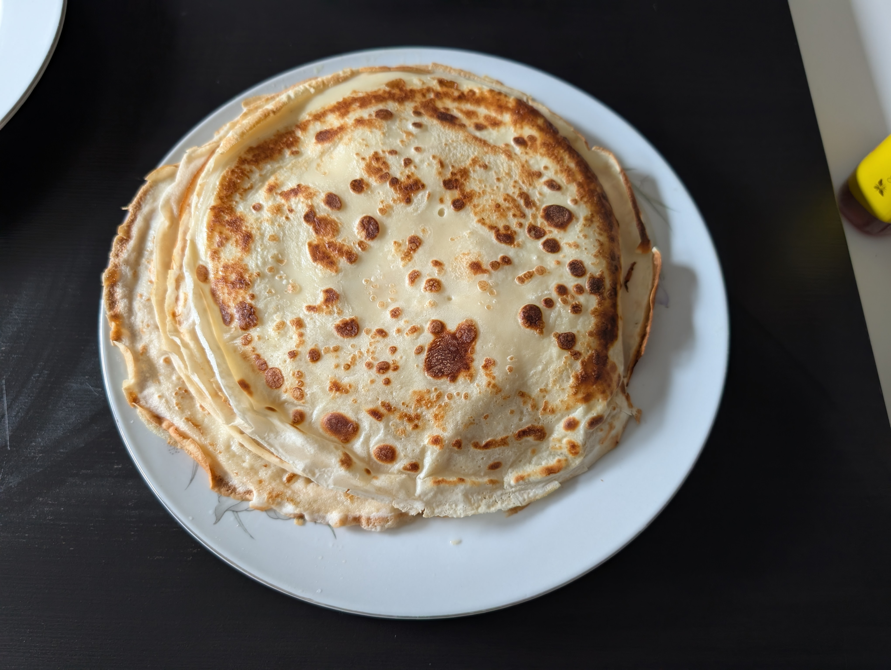

---
tags:
  - sweet
category:
  - cooking
country:
  - austria
duration_min: 
todo: false
theme: tre_light
marp: false
paginate: false
aliases: 
acknowledgements: 
links:
  - https://www.gutekueche.at/einfaches-palatschinkenrezept-rezept-4278
---
# Palatschinken

|Ingredient|Amount (4 portions)|
| :- | :- |
|milk|400 mL|
|flour|200 g|
|egg|2|
|salt|0.32 g|
|butter|-|
|oil|-|
|sparkling water|-|

## Recipe

### Dough
1. mix **flour**, **milk**, **egg**, and **salt**
1. let rest for ~10min
1. stir once again
    1. if dough too viscous add **sparkling water**

### Baking the Palatschinken
1. heat pan to reach [leidenfrost effect](https://en.wikipedia.org/wiki/Leidenfrost_effect) ([Leidenfrost, 1964](../references/references.pdf))
2. add **oil**/**butter** to pan
    1. distribute with paper towel to only have thin layer
3. add one scoop of [dough](#dough) in the center of the pan
    1. swing [dough](#dough) until bottom of pan is covered equally (thin)
    1. turn over to bake from both sides

## Notes
