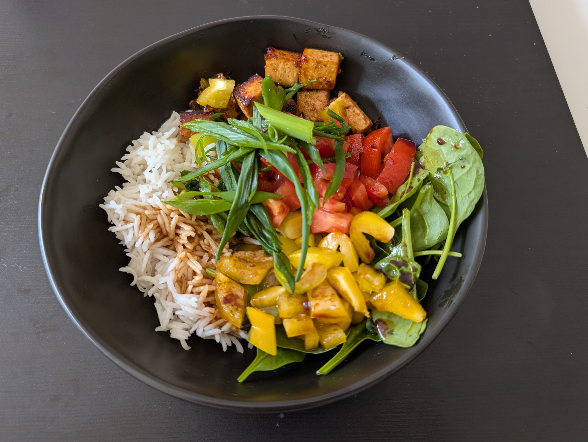

# Poke Bowl

|Ingredient|Amount (4 portions)|
| :- | :- |
|tofu|300 g|
|oil|240 mL|
|soy sauce|240 mL|
|vinegar|6 mL|
|lemon|4|
|spring onion|4|
|garlic|3|
|ginger|-|
|peanut butter|-|
|salt|-|
|starch|-|
|edamame|-|
|mango|-|
|nuts|-|
|pomegranate|-|
|rice|-|
|salad|-|
|spinach|-|
|tomato|-|
|cucumber|-|

## Recipe

1. Combine various different options from [Base](#Base), [Protein](#Protein), [Veggies](#Veggies), [Sauce](#Sauce), [Toppings](#Toppings)

### Base
Typical options:
1. [Rice](Rice.md)
2. [Couscous](Couscous.md)

### Protein
Typical options:
1. [Tofu_Fried](Tofu_Fried.md)
2. [Chicken_Teriyaki](Chicken_Teriyaki.md)

### Fruits and Veggies

In principle you can put whatever you wish.
Just be creative!
Typical options:
1. spring onion
2. edamame
3. pomegranate
4. mango
5. tomato
6. cucumber
7. salad
8. spinach

### Sauce
Typical options:
1. [PokeBowl_Sauce](PokeBowl_Sauce.md)
2. [Teriyaki_Sauce](Teriyaki_Sauce.md)

### Toppings
Typical options:
1. peanuts
2. cashews
3. sesame seeds

## Notes
1. this is just a variation of the original Hawaiian dish, which might or might not preserve the original traits.