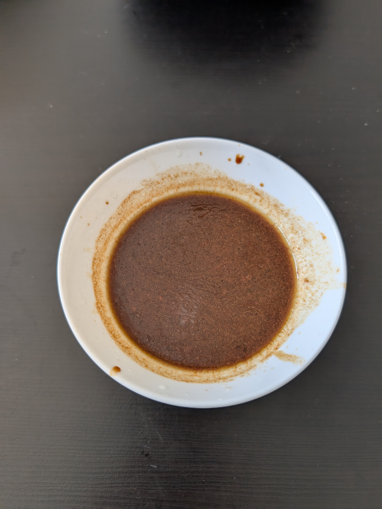

---
tags:
  - sauce
category:
  - cooking
country: 
duration_min: 
todo: false
theme: tre_light
marp: false
paginate: false
aliases: 
ingredients:
  - oil
  - soy sauce
  - vinegar
  - lemon
  - garlic
  - ginger
amounts:
  - 240mL
  - 240mL
  - 6mL
  - "4"
  - "0"
  - "0"
acknowledgements: 
links:
---

# Poke Bowl (Sauce)

## Ingredients

## Recipe
1. combine **soy-sauce**, **oil**, **vinegar (rice)**, **lemon**, **garlic**, **ginger** in small bowl
2. whisk until well mixed

## Notes

* [https://thewoodenskillet.com/easy-poke-sauce-recipe/ ](https://thewoodenskillet.com/easy-poke-sauce-recipe/ )
