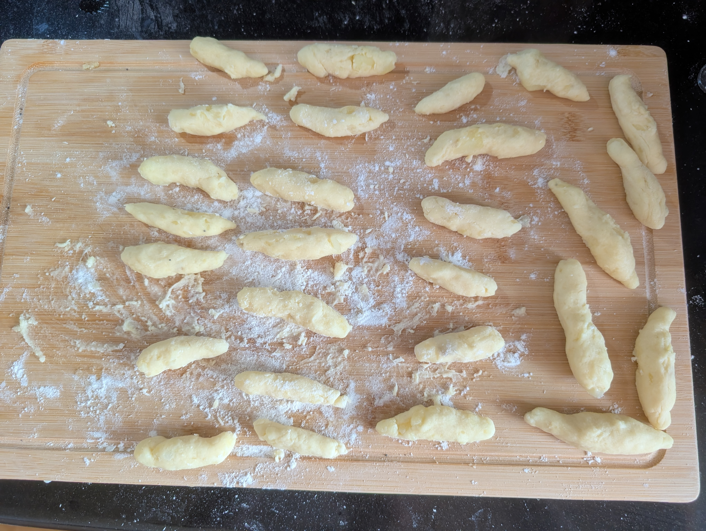

---
tags:
  - base
  - dough
aliases:
  - kartoffel teig
category:
country:
duration_min:
todo: false
acknowledgements:
links:
  - https://www.motioncooking.com/rezept/kartoffelteig-grundrezept/
theme: tre_light
marp: false
paginate: false
---

# Potato Dough

|Ingredient|Amount (4 portions)|Alternative Units|
| :- | :- | :- |
|potato|1200 g|
|flour (wheat)|160 g|
|starch (corn)|100 g|
|farina|80 g|
|butter|60 g|
|egg|2|
|salt|2 tsp|

## Recipe
1. boil **potatoes** with peel still on
2. whisk **egg**
3. push through potato-press while still hot
	1. no need to peel (peel stays in the press anyway)
4. let potato mash cool down just enough so you can touch it
5. heat **butter** until liquid
6. add **farina**, **salt**, **butter** to **potatoes**
7. form a small dent in the center
	1. add **egg**
8. mix **flour**, **starch (corn)**
	1. drizzle over **potatoes**
	2. ideally through a sieve
9. knead to a smooth dough
	1. DO NOT KNEAD FOR TOO LONG
	2. dough should not stick to fingers in the end
10. form dough into a ball
11. let rest for $\approx \pu{15min}$
12. drizzle dough with **flour** before moving on to shaping into derived products (i.e.: [Mohnnudel](./Mohnnudel.md))

## Notes
* ideally you want to use
	* floury **potatoes**
	* coarse-grained **flour**
