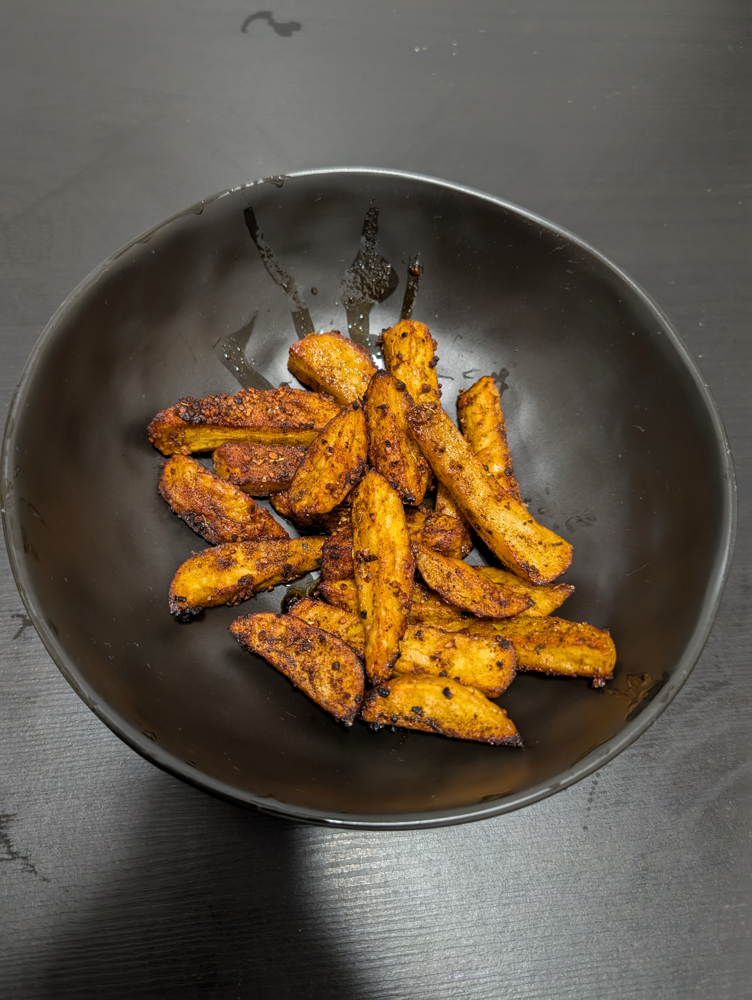

---
tags:
  - side
  - potato
aliases: 
category:
  - side
country: 
duration_min: 45
todo: false
acknowledgements: 
links: 
theme: tre_light
marp: false
paginate: false
---

# Potato Wedges

|Ingredient|Amount (4 portions)|
| :- | :- |
|oil|3 tbsp|
|pepper spice|1.5 tsp|
|potato|4|
|garlic powder|1.5 tsp|
|salt|1 tsp|
|pepper|0.5 tsp|

## Recipe
### Seasoning
1. mix **pepper spice**, **garlic powder**, **onion powder**, **salt**, **pepper**

### Main
1. preheat oven to $220°C$
2. cut **potatoes** $0.5\,cm\times0.5\,cm$ pieces
	1. cut along length to get cuboids
3. place **potatoes** in large bowl
4. add **olive oil**
	1. toss with hand
5. add [Seasoning](#Seasoning)
	1. toss with hand until **potatoes** are well-covered
6. spread **potatoes** on oven-tray
7. bake for $35\,min$ ([Fan Grill](OvenSettings.md#Fan%20Grill), [Conventional](OvenSettings.md#Conventional))
	1. turn once after $20\,min$

## Dipping Sauces that Fit
* [SourcreamSauce](SourcreamSauce)

## Notes
