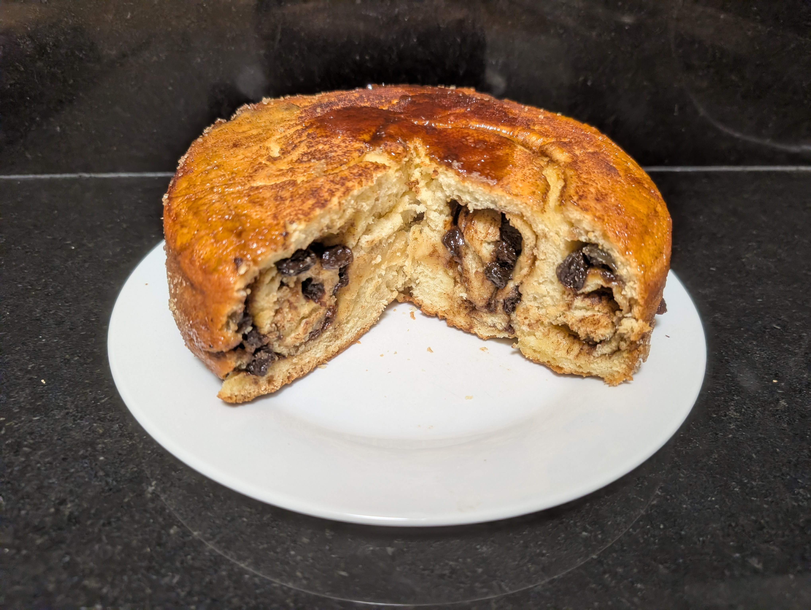
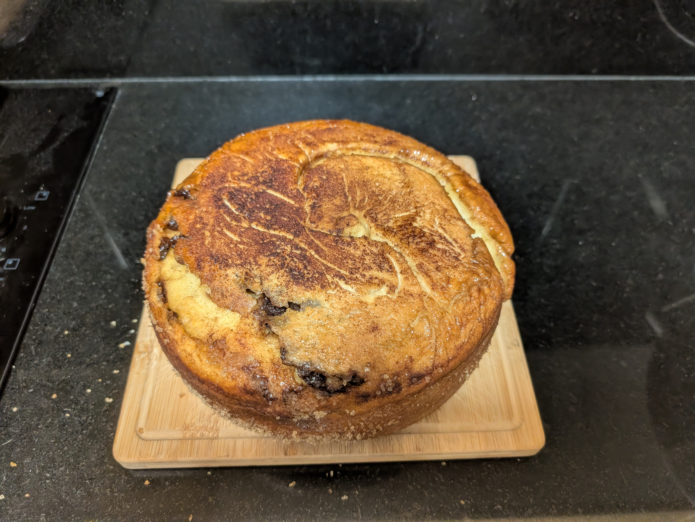
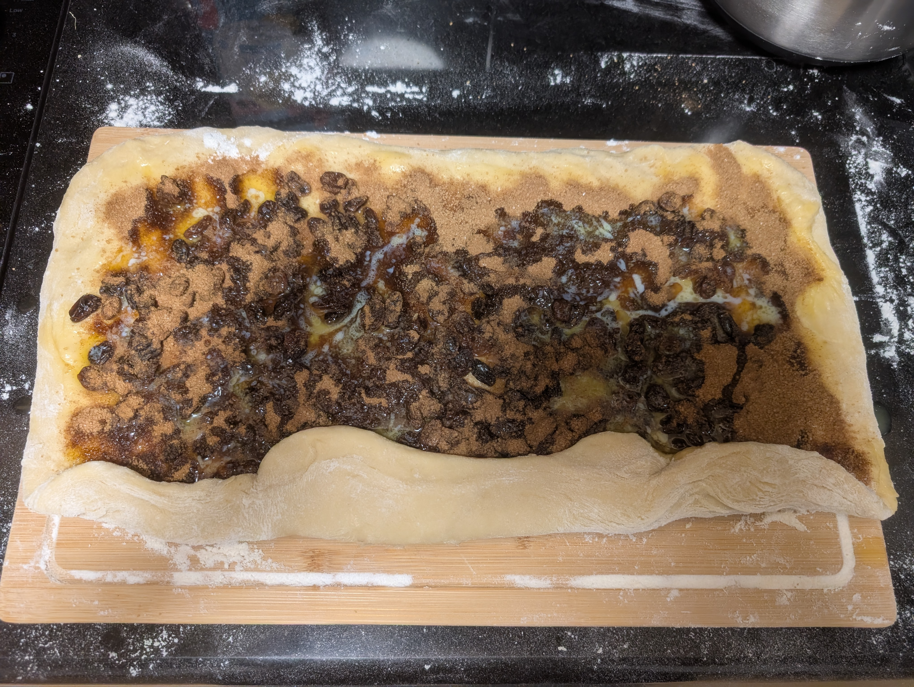
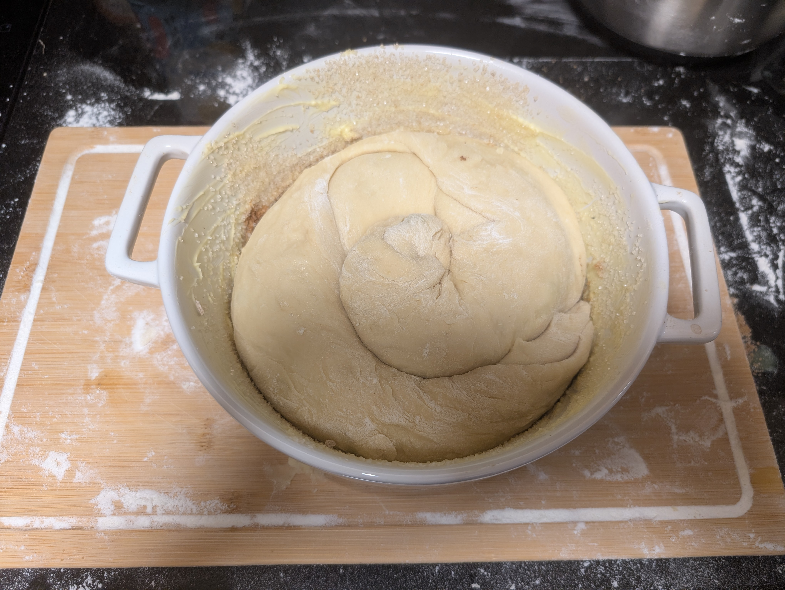
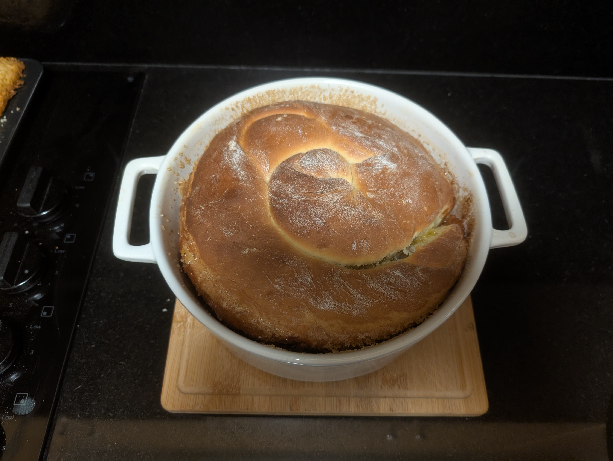

---
tags:
  - baking
  - tradition
  - easter
category:
  - cooking
country:
  - austria
duration_min:
todo: false
theme: tre_light
marp: false
paginate: false
aliases:
  - Kärntner Reindling
acknowledgements:
links:
  - https://www.finis-feinstes.at/r/original-karntner-reindling-920/
  - https://www.facebook.com/watch/?ref=saved&v=862938853427378
---

# Kärntner Reindling
|||
|:-:|:-:|
|||

|Ingredient|Amount (1 Reindling)|Alternative Units|
| :- | :- |:-|
|flour (wheat)|500 g|
|milk|250 mL|
|sugar|180 g|
|raisin|150 g|
|butter|140 g|
|cinnamon|16 g|2 tbsp|
|salt|10 g|1.5 tbsp|
|vanilla sugar|9 g|
|egg|3|possibly 2 work as well|
|juice (apple)|0|
|yeast (dry)|according to description|

## Recipe
> **butter** has to be at room temperature (soft but not liquid)

### Before starting
1. place **raisins** into **apple juice** and let them soak for $\approx \pu{30min}$

### Dough
1. add **flour** to bowl
2. create small valley in center
	1. heat **milk** until [handwarm](handwarm.md)
	2. add $\pu{125mL}$ of the **milk**
	3. add **yeast (dry)**
	4. add $\pu{80g}$ of **sugar**
	5. mix until you get a liquid pre-dough (inside the valley)
	6. sprinkle with **flour** until surface slightly covered
3. cover with cloth and let rest for $\pu{20min}$ at warm location
	1. until visibly increased in volume and sprinkled flour shows slight cracks
	2. I often use the oven without turning it on
4. add $\pu{40f}$ **butter**, **eggs**, $\pu{125mL}$ **milk**, $\pu{80g}$ sugar, **salt**, **vanilla sugar**
5. mix until a smooth dough emerges
	1. ideally you use a kitchen-aid
	2. you can also do it by hand/with a fork
		1. that's what I usually do
6. shape into a rough sphere
7. cover with cloth and let rest for $\pu{20min}$ at warm location

### Filling
1. mix **cinnamon**, $\pu{100g}$ **sugar**
	1. I usually put them both in a jar and just shake

### Preparing the baking dish
1. cover with butter
2. add a thin layer of **sugar**

### Merging
1. spread [Dough](#Dough) on slightly floured surface until $\approx \pu{0.5cm}$ thick and approximately rectangular
	1. you will have to do this in small steps as the [Dough](#Dough) will try to contract
2. melt $\pu{80g}$ **butter**
3. brush the [Dough](#Dough) with butter
4. distribute [Filling](#Filling) across [Dough](#Dough)
5. tightly roll dough into a long strand
6. roll result into a spiral
7. place into the prepared baking dish
8. cover with cloth and let rest for $\pu{45min}$ at warm location

|||
|:-:|:-:|
|||

### Baking
1. $\pu{30min}$ after the final rest, preheat oven to $\pu{170}^\circ C$
	1. use [Fan-Forced](OvenSettings.md#Fan-Forced)
2. bake [Reindling](Reindling.md) for $\pu{45min}$ on central tray
3. once done, release [Reindling](Reindling.md) from baking dish while still hot
4. let cool and enjoy

## Notes
* traditionally one would use **rum**, but I prefer **juice (apple)**
* if you have a proper *bundt pan* (gugelhupfform)
	* you can skip rolling the strand into a spiral and just place it straight into the form
* if the dough is too sticky
	* drizzle the surface with a little flour to make it workable
* in case the [Reindling](Reindling.md) does not want to come out of the form, bake for a few minutes with opening of baking dish on the bottom (upside down)