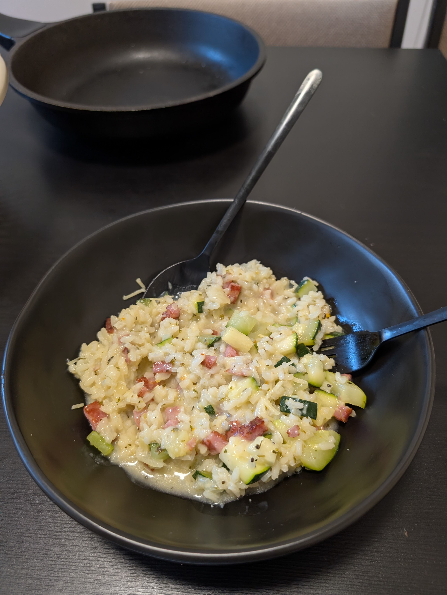

---
tags:
  - risotto
category:
  - cooking
country:
  - italy
duration_min: 
todo: false
theme: tre_light
marp: false
paginate: false
aliases: 
acknowledgements: 
links:
---

# Risotto Agli Zucchini

|Ingredient|Amount (4 portions)|
| :- | :- |
|water|1800 mL|
|rice|800 g|
|(bacon cubes)|200 g|
|parmesan|40 g|
|garlic|2 cloves|
|zucchini|2|
|onion|1|
|soup  sesaoning|-|
|oil|-|

## Recipe
1. preparation
    1. chop **garlic**, **onion**, and **zucchini**
1. prepare [vegetable broth](./soup_vegetables.md)
    1. alternatively dissolve **soup seasoning** in **water**
1. merge
    1. (if **bacon cubes**)
        1. heat **bacon cubes** in pan
    1. heat **oil** in pan
    1. add **onion**
    1. add **garlic**
    1. add **rice** into pan
    1. bit by bit add [vegetable broth](./soup_vegetables.md) until **rice** absorbed it all
        1. **rice** shall be nice and soft after the process
    1. add **zuchini** and **parmesan**
    1. season with **salt**, **pepper**, **basil**, **oregano**, **italian herbs** and mix well

## Notes
* recipe from a former italian chef