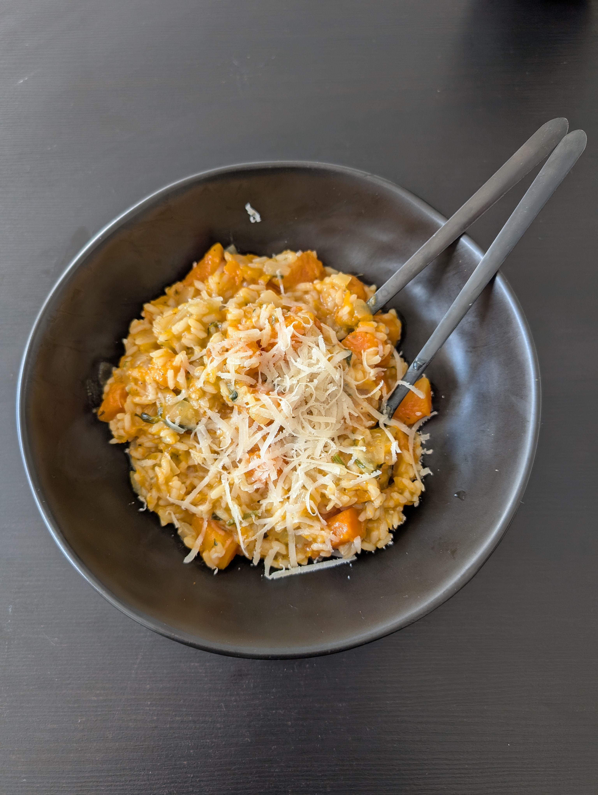

---
tags:
  - risotto
category:
  - cooking
country:
  - italy
duration_min: 60
todo: false
theme: tre_light
marp: false
paginate: false
aliases: 
acknowledgements: 
links:
  - https://www.jamieoliver.com/recipes/rice-recipes/silky-squash-risotto/
---

# Risotto alla Zucca

|Ingredient|Amount (4 portions)|
| :- | :- |
|pumpkin|1200 g|
|water|1200 mL|
|rice|300 g|
|wine (white)|150 ml|
|parmesan|50 g|
|celery|1|
|onion|1|
|soup seasoning (vegetables)|-|
|butter|-|
|marjoram|-|
|oil|-|

## Recipe
1. preparation
    1. chop **onion**, **pumpkin** (1cm chunks), **celery** (1cm chunks)
2. prepare [vegetable broth](./Soup_Vegetables.md)
    1. alternatively dissolve **soup seasoning** in boiling **water**
3. cook **pumpkin**
    1. add **oil** into pan
    2. add **pumpkin**
    3. season with **salt**, **pepper**, **marjoram**
    4. roast until slightly brown on both sides
    5. add a little bit of [vegetable broth](./Soup_Vegetables.md)
    6. let simmer until tender (add lid on pot)
4. merge
    1. roast **onion**, **celery** in pan using **oil**
        1. until soft
        2. add water if **celery** is not getting soft quickly
    2. add **rice**
        1. let roast for about 2min
    3. pour in (**wine**), [vegetable broth](./Curry_Vegetables.md) until fully absorbed
        1. low heat
        2. constantly stir
    4. stir **pumpkin** into risotto
    5. add enough broth to make risotto oozy
    6. mix in **parmesan**, **butter**

## Notes
1. **celery** can be substitute with at least an equal amount of additional **pumpkin**
