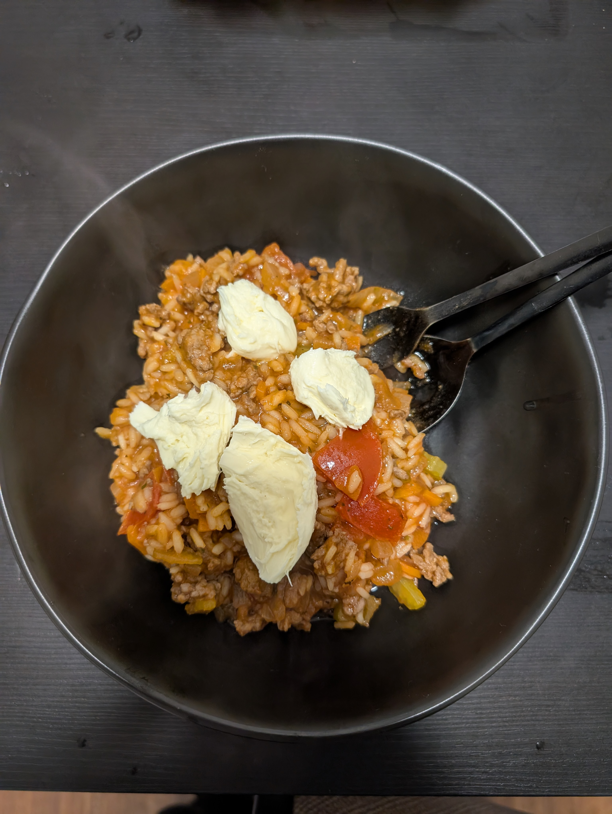

---
tags:
  - risotto
category:
  - cooking
country:
  - italy
duration_min: 
todo: false
theme: tre_light
marp: false
paginate: false
aliases: 
acknowledgements: 
links:
---

# Risotto Bolognese

|Ingredient|Amount (4 portions)|
| :- | :- |
|water|650 mL|
|tomato-sauce|330 mL|
|rice|250 g|
|parmesan|100 g|
|celery|50 g|
|oil (olive)|30 mL|
|butter|15 g|
|bay leaf|1|
|carrot|1|
|onion|1|
|tomato|150 g|
|minced meat|0.2 kg|
|basil|-|
|italian herbs seasoning blend|-|
|pepper|-|
|salt|-|
|soup seasoning (vegetables)|-|

## Recipe
1. chop **onion**, **carrot**, **celery**, **tomato**
2. prepare [vegetable broth](Soup_Vegetables.md)
	1. alternatively dissolve **soup seasoning** in boiling **water**
3. heat **oil** in large pan
4. roast **onions** until glossy
5. add **minced meat (beef)** and roast alongside
	1. season with **salt**, **pepper**
6. add **tomato**, **carrot**, **celery**
	1. roast alongside for a short time (no crunchyness wanted)
7. add **tomato-sauce**
	1. season with **salt**, **pepper**, **italian herbs seasoning blend**
8. add **bay leave**
8. add **rice**
	1. let roast for about $2\,min$
9. pour in (**wine**), [vegetable broth](Soup_Vegetables.md) until fully absorbed
	1. low heat
	2. constantly stir
	3. make sure to add enough to make #risotto oozy
10. mix in **parmesan**, **butter**
11. serve with **basil**

## Notes

