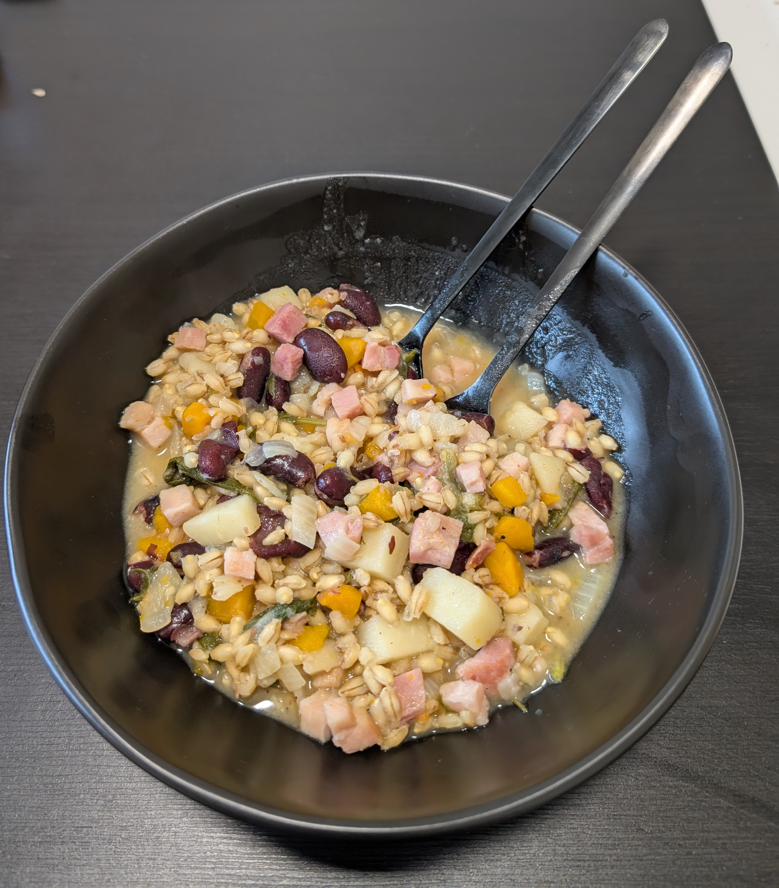

---
tags:
  - stew
category:
  - cooking
country:
  - austria
duration_min: 90
todo: false
theme: tre_light
marp: false
paginate: false
aliases: 
acknowledgements: 
links:
  - https://www.ichkoche.at/kaerntner-ritschert-rezept-228054
---

# Ritschert

|Ingredient|Amount (4 portions)|
| :- | :- |
|water|670 mL|
|barley (pearl)|140 g|
|beans|140 g|
|ivy (ground)|3.5 g|
|lovage|3.5 g|
|sage|3.5 g|
|carrot|1.5|
|spring onion|1.5|
|potato|1.5|
|bay leaf|1|
|celery|1|
|meat (selch)|1|
|pepper|-|
|salt|-|
|oil|-|
|sausage (selch)|-|
|soup seasoning (vegetables)|-|

## Recipe
1. peel and chop **onion**, **potato**, **carrot**, **celery** into small cubes
2. roast **onion** in oil in a large pot
3. add **potato**, **carrot**, **celery**
4. continue roasting for short time
    1. no crunchyness wanted
5. add **bean**, **barley (pearl)**, **water**
6. immediately add **ivy (ground)**, **lovage**, **sage**
7. season with **salt**, **pepper**
    1. optionally add **soup seasoning (vegetables)**
8. cut **meat (selch)** into pieces
9. add to pot
10. let entire mixture cook until **meat (selch)** cooked through and **barley (pearl)** soft
    1. ritschert shall have a viscid consistency
11. keep stirring every now and again
12. add **water** if necessary to make sure ritschert does not stick to the base of the pot

## Notes
* traditionally served with dark bread
