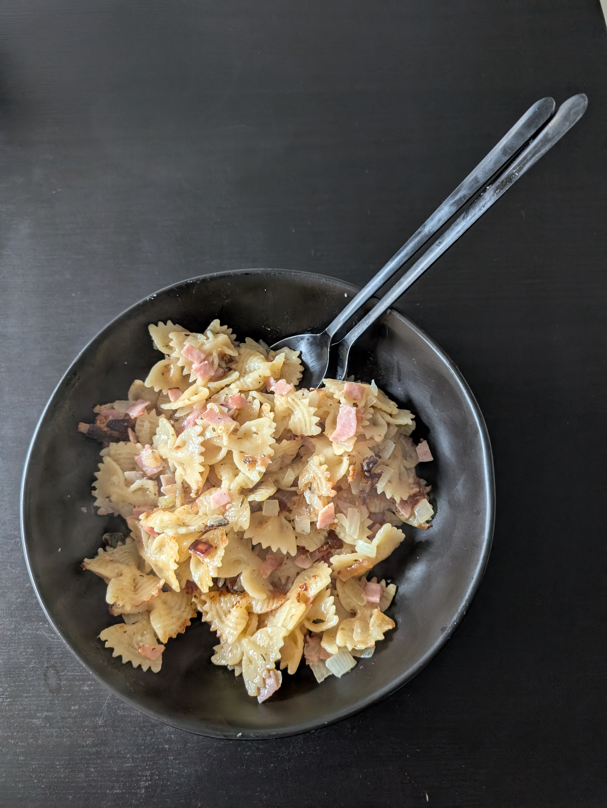

---
tags:
  - pasta
aliases: 
category: 
country: 
ingredients:
  - pasta
  - cream
  - cheese
  - ham
  - egg
  - garlic
  - onion
  - marjoram
  - oil
  - pepper
  - salt
amounts:
  - 400g
  - 200mL
  - 100g
  - 12dag
  - "1"
  - "1"
  - "1"
  - "0"
  - "0"
  - "0"
  - "0"
duration_min: 
todo: true
acknowledgements: 
links:
  - https://www.gutekueche.at/schinkenfleckerl-rezept-4907
theme: tre_light
marp: false
paginate: false
---

# Schinkenfleckerl

## Recipe

1. chop **onions**, **garlic**, **ham** in small pieces
2. cook **pasta**
3. head **oil** in pot
4. roast **onions**
5. add **garlic** to roast alongside
6. add **ham** to roast alongside
7. add **pasta**, **cheese**
8. mix well
9. season with **salt**, **pepper**, **marjoram** as you go

### variation: baked
1. proceed as in [Recipe](#Recipe)
2. mix **egg**, **cream**, **salt**
3. pour over finished Schinkenfleckerl
4. grate **cheese** atop
5. bake in oven at $180°C$ for $12\,min$ 

## Notes
