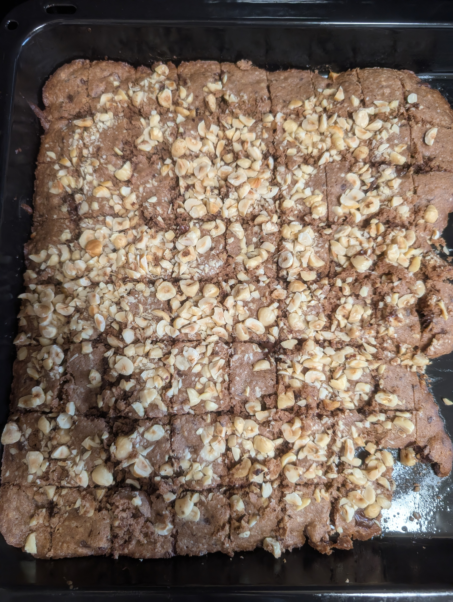
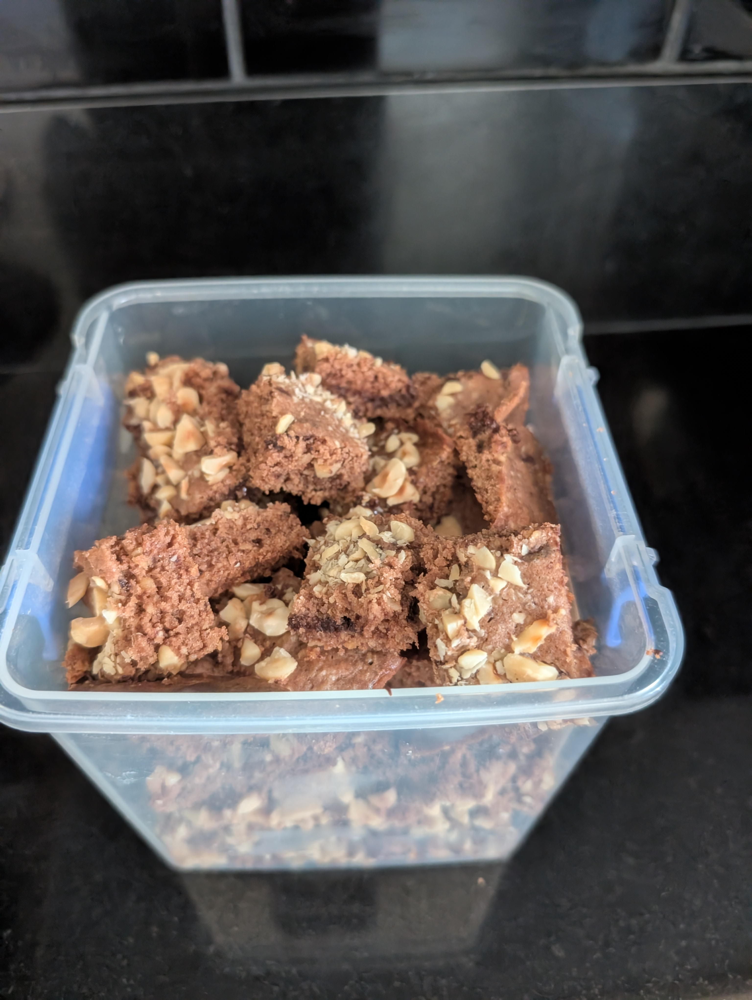

---
tags:
  - baking
  - tradition
  - christmas
aliases:
  - Schoko-Nuss Stangerl
country:
  - austria
duration_min: 90
todo: false
acknowledgements:
  - Daniela Steinwender
links:
theme: tre_light
marp: false
paginate: false
---

# Schoko-Nuss Stangerl

|     |     |
| --- | --- |
|||

|Ingredient|Amount (64)|Alternative Units|
| :- | :- | :- |
|butter|130 g|
|chocolate|130 g|
|flour (wheat)|130 g|
|sugar|130 g|
|hazelnuts|100 g|
|walnuts|80 g|
|egg|3|
|baking powder|1 tsp|

## Recipe

### Prep
1. separate **egg-yolk** from **egg-white** of **eggs**
2. whisk **egg-white** until stiff
3. grate **walnuts**
4. chop **chocolate** into cubes
5. chop **hazelnuts**

### Dry
1. mix **flour (wheat)** (ideally you run through a sieve) with **baking powder**

### Butter - egg-yolk mixture
1. heat **butter** in pot
	  1. stir until foaming
2. turn off heat
3. add **sugar**
4. add **egg-yolk**
5. mix well

### Main
1. add [Butter - egg-yolk mixture](#Butter%20-%20egg-yolk%20mixture) to [Dry](#Dry)
2. add **chocolate** to [Dry](#Dry)
3. add **walnuts** to [Dry](#Dry)
4. fold **egg-white** into the mixture

### Baking
1. place baking tray on central position
2. preheat oven to $\pu{175^\circ C}$ [Fan-Forced](OvenSettings.md#Fan-Forced) 
3. grease baking tray with **butter**
4. distribute result from [Main](#Main) on baking tray
	1. $\pu{1cm}$ thickness
5. sprinkle **hazelnuts** on top
6. bake for $\pu{20min}-\pu{25min}$
7. while still hot
	1. cut in cuboid pieces with dimension $\approx (2,2,1)\,\pu{cm}$ (W,L,H) (stangerl)
8. let cool down before transferring to container

## Notes
