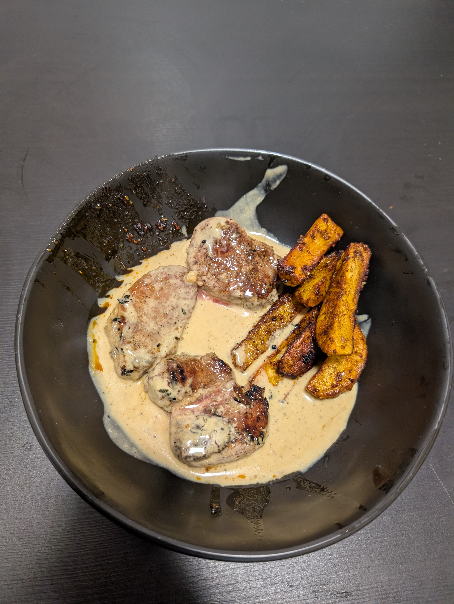

---
tags:
  - meat
  - protein
category:
  - cooking
country: 
duration_min: 
todo: true
theme: tre_light
marp: false
paginate: false
aliases: 
ingredients:
  - pork filet
  - cream
  - water
  - bay leaf
  - garlic
  - mustard
  - oil
  - pepper
  - peppercorns
  - salt
  - soup seasoning (beef)
  - soy sauce
  - thyme
amounts:
  - 600g
  - 250mL
  - 200mL
  - "2"
  - 2cloves
  - 1tsp
  - "0"
  - "0"
  - 3tsp
  - "0"
  - "0"
  - 1tbsp
  - 3twigs
acknowledgements: 
links:
  - https://emmikochteinfach.de/schweinemedaillons-in-pfefferrahmsauce/
---

# Schweinsmedallions mit Pfefferrahmsauce

## Recipe

### The Filets
1. rinse **thyme**
2. don't peel but just squish **garlic**
3. cut **pork filet** into $2.5-3\,cm$ thick pieces
4. season **pork filet** on either side with **salt**
5. heat **oil** in pan
6. add **thyme**, **garlic**, **bay leaf**, **pork medallions**
7. roast **pork medallions** on high until golden ($\approx 2\,min$)
	1. in batches to not overcrowd the pan
	2. too many lead to the pan not being able to keep up the heat
	3. **pork medallions** might get dry
8. take everything except sauce out of pan
	1. season with **pepper**
	2. keep warm in a separate container (including **thyme**, **garlic**, **bay leaf**)

### The Peppersauce
1. add **wine** to the pan from [The Sauce](#The%20Sauce)
2. add [Soup_Beef](Soup_Beef.md) 
	1. alternatively
		1. boil **water**
		2. mix with **soup seasoning (beef)
		3. add instead of [Soup_Beef](Soup_Beef.md)
3. let reduce for $\approx2\,min$
4. add **cream**, **pepper corns**, **mustard**
5. let boil once and simmer for a little bit
6. season with **salt**, **pepper**, **soy sauce**
7. put [The Filets](#The%20Filets) into the [The Peppersauce](#The%20Peppersauce)
8. let rest for $\approx1\,min$ (put lid on pan)

## Side
* [PotatoWedges](PotatoWedges.md)
* [Rice](Rice.md)
* [Kroketten](Kroketten)
* [Roesti](Roesti)

## Notes
